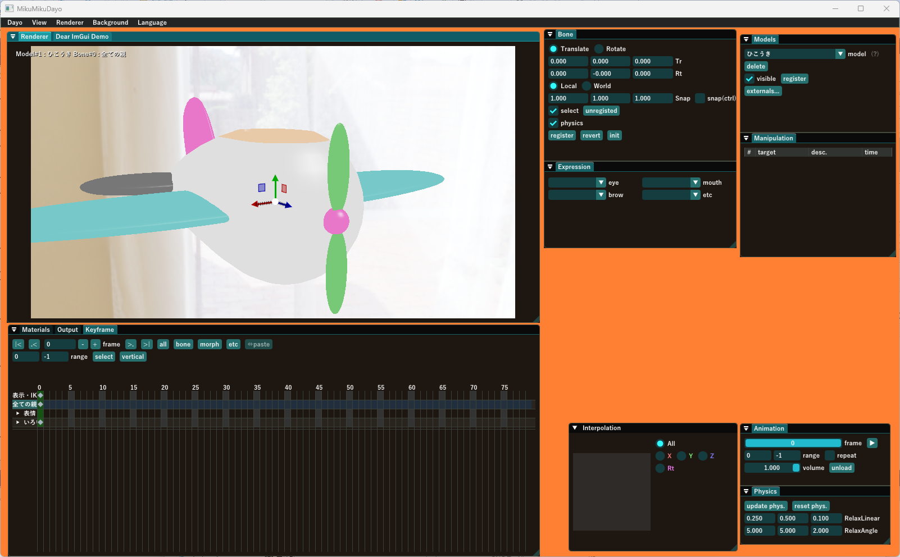

# MikuMikuDayo  version 1.00

- **Windows Updateおよびグラフィックスカードのドライバは最新にしてください。「ちょっとくらい古くてもいいだろう」と思うかもしれませんが、レイトレーシングのドライバは意外とバグがまだ残っていて、ちょっとアップデートするだけでバグが治ってたりします。これまでのテストで得られた重要な知見ですからくれぐれもバグ報告などをする前にチェックしてください。**

## 更新履歴
[こちら](update.md)

## ご注意
- ご報告・ご連絡については一番下のFAQを見て下さい
- 互換性を無視したバージョンアップが行われる可能性はあります
- バージョンごとに不具合修正や新要素の追加がありますから、レンダリング結果の細かい見た目は変わる事があります
- 以前のバージョンから引き続き使用する場合は別のフォルダにインストールするのが確実ですが、上書きして使う場合は必ず`shadercache`フォルダの内容を消去してください

- **FAQを読んでいないことが明らかに分かる場合は何も反応できませんので悪しからず**
- **Windows Updateおよびグラフィックスカードのドライバは最新にしてください。「ちょっとくらい古くてもいいだろう」と思うかもしれませんが、レイトレーシングのドライバは意外とバグがまだ残っていて、ちょっとアップデートするだけでバグが治ってたりします。β1テストで得られた重要な知見ですからくれぐれもバグ報告などをする前にチェックしてください。**

## 概要
なんかこれじゃないPMXファイル用のレンダラでした  
sdPBRなどのシェーダを作るにあたって新しいレンダリング手法を試す時には、お手本が無いと結果が正しいのかどうかわかりませんので、そのお手本を作るためのモノでした  
一応、動画を作って遊べるようにはなりました  

- **Windows Updateおよびグラフィックスカードのドライバは最新にしてください。「ちょっとくらい古くてもいいだろう」と思うかもしれませんが、レイトレーシングのドライバは意外とバグがまだ残っていて、ちょっとアップデートするだけでバグが治ってたりします。β1テストで得られた重要な知見ですからくれぐれもバグ報告などをする前にチェックしてください。**

## 大体できました
version 1.00としてますが、完成と言えるのはきっとまだ先でしょう。ひきつづきよろしく  

- **Windows Updateおよびグラフィックスカードのドライバは最新にしてください。「ちょっとくらい古くてもいいだろう」と思うかもしれませんが、レイトレーシングのドライバは意外とバグがまだ残っていて、ちょっとアップデートするだけでバグが治ってたりします。β1テストで得られた重要な知見ですからくれぐれもバグ報告などをする前にチェックしてください。**

## 動作環境
- Windows11専用
- DirectX raytracingのハードウェアサポート必須。具体的にはGeForceRTX2060以降です。Radeon+DXR環境でのテストはできてません。

## 起動方法
エクスプローラ上で`MikuMikuDayo.exe`をダブルクリック！  

- DLLが無くて起動しない場合は[こちら](https://learn.microsoft.com/ja-jp/cpp/windows/latest-supported-vc-redist?view=msvc-170)
- どれをダウンロードしたらいいのか分からない場合は多分[これ](https://aka.ms/vs/17/release/vc_redist.x64.exe)です
- **Windows Updateおよびグラフィックスカードのドライバは最新にしてください。「ちょっとくらい古くてもいいだろう」と思うかもしれませんが、レイトレーシングのドライバは意外とバグがまだ残っていて、ちょっとアップデートするだけでバグが治ってたりします。β1テストで得られた重要な知見ですからくれぐれもバグ報告などをする前にチェックしてください。**

## 操作方法

項目名を見れば一目瞭然である物についての説明は割愛しています

### ファイルのドラッグ&ドロップ
エクスプローラからファイルのドラッグ&ドロップでアセット(モデルやテクスチャなどを総じてこの文書ではそう呼ぶことにします)の読み込みができます

- `pmx`ファイルをドロップするとモデルを追加します。PMX2.0/PMX2.1形式のみ対応しています(`pmd`や`x`は不可)
- `bmp`, `jpg`, `png`, `hdr`, `dds`ファイルをドロップすると背景として画像を追加します。背景画像の取り扱われ方はレンダラに依存します。標準で用意されているレンダラではskyboxとして使われます(`exr`にはまだ対応していません)
- `wav`, `mp3`, `m4a`ファイルをドロップすると音声データとして読み込みます。再生中に演奏される他、キーフレーム表示ウィンドウ上で波形を表示します
- `vmd`ファイルをドロップするとモーションデータとして編集対象となっているカメラ・光源またはモデルに読み込みます
- `vpd`ファイルをドロップするとポーズデータとして現在のフレームに読み込み、登録します。Ctrl+Zでアンドゥできます
- `mp4`,`avi`ファイルをドロップすると背景動画データとして読み込みます、モデルのテクスチャにscreen.bmpが割り当てられている場合その内容が動画ファイルの内容になります。

### Dayoメニュー
- 主にMikuMikuDayoのプロジェクトファイルである`dayo`ファイルの読み書きが出来ます。本家MMD+MMEでいう`pmm`ファイルと`emm`ファイルをくっつけたようなモノです
- MikuMikuDayo自体の設定(表示言語の設定など)ができます
- `VMD`ファイルフォーマットでモーションデータのエクスポートができます。本家MMDへデータをエクスポートしたい時にどうぞ

### Viewメニュー
- **情報表示** Rendererウィンドウに表示fpsなどのデータを表示するようになります。音声データを読み込んである場合は音声データの波形を表示します
- **剛体表示** 物理剛体の状態が表示されます
- **モデル編集時カメラ・光源追従** モデル編集時もフレームを切り替えた際にキーフレームの状態にカメラ・光源の状態が合います
- **物理演算をする** BulletPhysicsによる物理演算処理を使用します
- **デノイザを使う** Intel Open Image Denoiseを用いたデノイズ処理を行います。効果はレンダラの実装に依存します
- **(そのまま,1/2,1/4)の解像度で描画** 描画時の解像度をRenderウィンドウのサイズからさらに縮小して速度を向上させることが出来ます
- **動作モード** 
  - **サンプルためろ** 静止画用にサンプルを蓄積します。必要が無い限り物理演算などでモデルは動かない状態になります
  - **ガンガンいこうぜ** 常時物理演算などを行いモデルの状態は更新し続けられます。サンプルは蓄積されません
  - **でんきだいじに** サンプルの蓄積も常時物理演算も行われない省エネモードになります。操作性は最も良くなります

### Rendererメニュー
レンダラ(レンダリングに用いるエフェクト)を選択できます。レンダラ自体は各人で好きな実装を作って`renderer`フォルダに置くと使えるようになりますが、同梱のレンダラは以下の3つあります

- **BDPT** 双方向モンテカルロパストレーシングを用いたレンダラです。動作が非常に重いですが高品質です
- **Subayai** ラスタライザベースで部分的にレイトレーシングを用いた表現力があり高速なレンダラです。動画の作成に役立ちます
- **Preview** MMD用モデルを表示・確認するための軽いレンダラです。ある程度本家MMDに寄せてはありますが、特に互換性は無いのでご注意ください。ソースコードがシンプルなのでレンダラを自作する時の参考にどうぞ

BDPTを使う場合は、`postprocess/tonemapper/ACESTonemap.pmx`をドロップしてトーンマッパーを有効にしてください。また、`renderer/BDPT/dayorencon.pmx`もドロップすると露出補正や開口モーフによりDoF効果などの設定が行えます。

同様に、Subayaiを使う場合は、`postprocess/tonemapper/ACESTonemap.pmx`をドロップしてトーンマッパーを有効にしてください。また、`renderer/Subayai/subayairencon.pmx`もドロップすると露出補正などの設定が行えます。DoFについては`postprocess/DoF`にある物を使ってください。

### Backgroudメニュー
背景画像やMMDモデルの予約テクスチャ名`screen.bmp`を割り当てられた材質についての取り扱いを設定します。`screen.bmp`の内容は以下の基準に従って生成されます

1. 背景動画が読み込まれていない場合は前フレームにおけるレンダリング結果
2. 背景動画が読み込まれている場合は背景動画の内容
3. 以下のメニューの設定でscreen.bmpが無効になっている場合は白一色のテクスチャとする

以下、メニュー項目の説明です

- **screen.bmpを無効にする** screen.bmpを無効にします
- **screen.bmpをトリミングしない** そのまま使用します
- **screen.bmpを4:3でトリミングする** アクペクト比4:3でトリミングします
- **背景はレンダラのデフォルトにする** モデルが描画されていない部分はskyboxを表示するなどレンダラ実装依存の表示を行います
- **背景はα=0で出力する** モデルが描画されていない部分のα値は0として出力します。動画編集ソフトとの連携時に役立ちます。使用するレンダラ/ポストプロセスなどの実装によっては意図通りの結果が得られない事もありますのでご注意ください。

### Helpメニュー
- ショートカット一覧を表示してキーボードよる操作方法一覧を確認できます

### 各ウィンドウの操作

MikuMikuDayoが無事に起動できると以下のようにメインウィンドウ全体の中に小さなサブウィンドウが沢山でてきます

サブウィンドウは個々に移動やリサイズ、ドッキングが可能ですから好きにレイアウトしてください

ウィンドウのレイアウトをリセットしたい場合は、一旦MikuMikuDayo.exeを終了して、MikuMikuDayo.exeと同じフォルダにある`imgui.ini`を削除すると次回起動時にデフォルトのレイアウトが読み込まれます

#### Modelsウィンドウ
編集対象のモデルを選択します。一番上の**Camera/Light**を選択するとカメラ・光源のキーフレームを編集するモード(以下、カメラ編集モード)になり、それ以外が選択されているとモデルのキーフレームを編集するモード(以下、モデル編集モード)になります

モデル編集モードの場合、以下の機能もModelsウィンドウに付きます。
- **モデルの削除** MikuMikuDayoから対象のモデルを除去します(元のpmxモデルデータは削除されません)
- **順序の設定** `order`ボタンを押すと、モーションの解決順・ポストプロセスの実行順・デフォーマの実行順・ラスタライザの実行順(表示順)をそれぞれ設定出来ます。ドラッグ&ドロップで並べ替えを行い、ESCでウィンドウを閉じます(今の所、内容変更のキャンセルができません)
- **表示・非表示の選択** `visible`チェックボックスで選択し`register`ボタンを押すと現在のフレームに表示・非表示キーが登録されます
- **外部親設定** `externals...`ボタンを押すと外部親設定ダイアログが開きます。編集中のモデルのボーンを他のモデルのボーンの子として制御できるようになります

カメラ編集モードの場合、以下の機能がウィンドウに付きます
- **再生中にカメラをマウスで動かせるようにする**
- **カメラの記録** `Animation`ウィンドウの再生範囲で指定された範囲の間のカメラのキーフレームを消去し、リアルタイムで記録した内容に上書します。カメラをマウスで操作し、スペースキーを押すとそのタイミングでキーフレームに書き込まれます。Ctrl+Zで上書き記録前の状態に戻せます。 

#### Keyframesウィンドウ

キーフレーム群に対する操作を行います。MikuMikuDayoでアニメーションを作成するにあたっては、キーフレームの集合としてモデル・カメラの運動を定義し、キーフレームを構成する個々の要素の事をMikuMikuDayoでは**キー**と呼びます

ボタンの上にマウスカーソルを合わせると各ボタンの機能やショートカットキーが表示されます

以下の機能があります

- **編集対象フレームの変更**
- **ボーンの選択**
- **キーの選択・削除・カット・コピー・ペースト**

1フレームあたりの時間は1/30秒で固定です

#### Manipulationウィンドウ
現在までキーフレーム群に対して行った操作の履歴が表示されます。新しい内容ほど上に表示され、Ctrl+Zキーを押したときにやり直しの操作の対象になる内容が白くハイライトされて表示されます

#### Rendererウィンドウ

シーンの表示やボーンの選択を行います。
- マウスの右ドラッグで視点の回転
- 中ドラッグで視点の平行移動

モデル編集モードではkeyframeウィンドウでボーンが1つ選択されている場合はボーンを操作するためのギズモが表示されます

ギズモ上でマウスの左ボタンをドラッグするとボーンの移動・回転を行い、右ボタンをクリックするとコンテキストメニューが開きます

- `register` ボーンに対する操作結果をキーフレームへ登録
- `revert` ボーンの状態をキーフレームの状態に巻き戻す
- `init` ボーンを初期状態にする

平行移動時のギズモの赤・緑・青各軸の矢印はX・Y・Z軸を表しており、矢印に黒い線が何本か入っている場合は各軸の⁻方向を示しています

また、右下のXYZと書いてある操作パネルで左ドラッグを行うとボーンの回転および平行移動を行うことが出来ます。Shift/Ctrlを押しながら操作すると早く/遅く操作が出来ます

#### Boneウィンドウ
モデル編集モード時のみ表示されます。

Keyframeウィンドウでボーンを選択できる他、ボーン選択モードにチェックを入れるとボーンが選択されていない場合にはRendererウィンドウにボーンを選択するためのマーカーが表示されます。

- `position`, `rotation` ボーンが1つだけ選択されている状態ではボーンの位置・姿勢をそれぞれで編集できます
- `Local`/`World` ギズモの操作軸をローカル/ワールド座標系で切り替えます
- `unregisted` キーフレームに登録されている状態と比較してボーンの状態が変化しているがキーフレームに未登録のボーンが選択されます
- `physics` ボーンの物理シミュレーション有効/無効を切り替えます
- `register` ボーンに対する操作結果をキーフレームへ登録
- `revert` ボーンをキーフレームの状態に巻き戻す
- `init` ボーンを初期状態にする

#### Expressionウィンドウ
モデル編集モード時のみ表示されます。

コンボボックスで操作したいモーフを選択してスライダーで影響量を操作、`register`でキーフレームへ登録します。

#### Cameraウィンドウ
カメラ編集モード時のみ表示されます

- `target` カメラの注目している位置を設定します
- `rotation` カメラの姿勢を設定します
- `distance` カメラの注目している位置からカメラ自体の位置までの距離を設定します
- `FoV` 垂直画角を設定します

- `bone-tracking` カメラが`model`と`bone`で指定されたボーンの位置に張り付くようになります。`position`は注目点の位置ではなくボーンの位置からの相対位置として解釈されます

- `register` カメラの状態をキーフレームへ登録します
- `init` カメラの位置・姿勢を初期化します

#### Lightウィンドウ
カメラ編集モード時のみ表示されます

*BDPTレンダラでの現在の実装では、この情報は特にレンダリング結果には反映されません*

- `color` 光源の色・明るさをRGBで設定します
- `direction` 光源の位置を

光源情報の扱われ方はレンダラに依存します。

- `register` 光源の状態をキーフレームへ登録します
- `init` 光源の位置・姿勢を初期化します

#### SelfShadowウィンドウ
カメラ編集モード時のみ表示されます

*BDPT,Previewレンダラでの現在の実装では、この情報は特にレンダリング結果には反映されません*

- `none`,`mode1`,`mode2` セルフ影の計算方法を3種類より選択できます
- `distance` セルフ影に対するパラメータを設定します

#### Interpolationウィンドウ
ボーンまたはカメラのキーを選択すると補間曲線の設定が出来ます。複数のキーを選択するとまとめて補間曲線を設定出来ます

ラジオボタンでキーのどの要素についての補間曲線を操作するのか選択できます。`All`を選択すると全ての要素を一括して設定出来ます

- `register` 操作結果をキーフレームに登録します(本家MMDとは違い、registerを押さないと編集フレームを切り替える際に操作内容は破棄されますのでご注意ください)
- `copy` 編集中の補間曲線を補間曲線用コピーバッファにコピーします
- `paste` 補間曲線をペーストします
- `init` 補間曲線を直線に初期化します

#### Animationウィンドウ
モーションの再生および音声の設定を行います。

- `▶️` モーションの再生/停止を行います
- `frame`  再生中のフレーム番号の表示の他、スライダーとしてドラッグすると当該フレームの状態を表示できます
- `range`  再生範囲を指定します-1を指定するとキーの打ってある最後のフレームとして解釈されます
- `repeat` 指定範囲を繰り返して再生します
- `speed`  再生速度を指定します。1.000で等倍、2で2倍速となります
- `volume` 音声の再生ボリュームを指定します
- `offset` 音声の再生開始位置を秒単位で指定します
- `unload` 音声ファイルをMikuMikuDayoから除去します。元の音声ファイルは削除されません

#### Physicsウィンドウ
物理演算の調整をします

- `gravity` 重力加速度の大きさを設定します
- `direction` 重力の働く方向を設定します。XYZの順に並んでおり、計算前に長さ1に正規化されます
- `noiseAmp.` 重力にノイズを付加する際の強度を設定します
- `noiseFreq.` ↑の変わりやすさを設定します
- `update` 1フレーム(1/30秒)の時間だけ物理演算の状態を進めます
- `reset` 物理演算の状態をリセットします
- `floor collision` 物理剛体と床との当たり判定をon/offします

#### Outputウィンドウ
画像の出力を行います。連番の画像ファイルとして動画も出力できます。

- `filename` 画像を出力するファイル名を設定します。`(?)`にカーソルを合わせると表示される通り、この項目で設定したファイル名を元にした連番の画像として出力されます
- `samples` 1フレーム出力するために何回レンダリングして平均を取るかを設定します
- `motion blur` 1サンプル毎にモーションと物理の更新をし直すことでフレーム間の素早い動きも画面に描写します
- `range` 出力するフレームの範囲を設定します。-1を指定するとキーの打ってある最後のフレームとして解釈されます。静止画を出力したい場合は出力範囲を1フレーム分にしてください
- `resolution` 出力画像の解像度を設定します
- `fps` 動画のフレームレートを設定します(出力ファイルはあくまで連番画像なので動画編集ソフトで同じfpsになるよう設定してください)

連番の画像ファイルとしての出力しか出来ませんが、動画ファイルの直接出力については対応しないつもりです。特にBDPTでの出力にはかなり時間が掛かる事が想定されるので、途中でクラッシュした場合の被害がデカすぎるためです。toolフォルダを覗いてみると役立つものがあるかもしれませんが、基本的には動画編集ソフトを使ってくださいね。

#### Materialsウィンドウ
エフェクトによってはモデルの各材質単位でエフェクトに注釈データ(以下、材質注釈と呼びます)を付ける事が出来ます。(同梱のエフェクトとしてはβ3時点ではBDPTレンダラだけです)

材質名の右に材質注釈を書いたファイルを指定できるので、`renderer\m`フォルダ内にある材質注釈を設定出来ます。例えば金属的な質感にしたい場合は`metal.txt`を割り当てるとそのようになります

材質注釈ファイルの書き方については後述します

レンダラの切り替えなどでエフェクト自体がメモリから破棄されると設定されていた材質注釈も全部無くなるのでご注意ください。BDPTだと重いのでPreviewに切り替えたいと思ってもPreviewに切り替えると材質注釈はリセットされます。`View`メニューの`1/4解像度で描画`などを使ってください

## MikuMikuDayoのエフェクトについて

hlslで自作することが出来ます！

MMEと互換性はありません！

だいぶん仕様も固まってきました！

今のところ、エフェクトは以下のように分類されます

- **deform** 
モデルの頂点情報と変換行列などからモデルの変形を行うエフェクト、モデルごとに別のエフェクトを設定出来ます
- **render** 
モデルの座標やテクスチャ、カメラの位置といった情報を元に画面の描画を行うエフェクトです。1つのレンダラを全部のモデルに適用します
- **postprocess** 
レンダラで出力した画像を加工して色調の補正などを行うエフェクトです。モデルや材質ではなく画面自体に掛かります

本家MMD+MMEでは各モデルの各材質ごとにエフェクトを指定し、変形と描画を一気に行っていました。このためパーティクルエフェクトを作ってパーティクルを構成するポリゴンの頂点を動かしたとして、パーティクルエフェクトの外からはモデル本来の頂点情報しか分からないので、パーティクルになる予定だった頂点群があるものとしてそのままポストプロセスなどが掛かっていわゆる**連凧**が現れたりしました

MikuMikuDayoではdeformとrenderを分離することでこの問題を解決しましたが、renderは材質や物体単位で別の物にすることが出来ず、全ての物体を同じシェーダで描画します。レイトレーシングでは物体が相互に反射する様子を考慮する事が大前提であるため、1つの物体だけ違う仕組みでレンダリングしようとすると、見た目に明らかにおかしな状態になるためです。HUDの表示などシーンと独立した表示内容の作成にはポストプロセスをうまく使った方がいいでしょう

色空間はsRGBリニアを念頭に置いています。ガンマでは無いのでピクセルシェーダ・レイトレーシングシェーダの入出力時にはご注意ください

本家MMEで使われていたMicrosoft純正のエフェクトフレームワークと比べるといまいちイケてなく感じるでしょう。なにしろあっちはコンパイラをいじって使い勝手を向上させていますから、それよりいいものは個人には作れませんが、Jsonnetのお陰で大分いいところまで来たと思います。

GPUがハングアップすると復帰する手立てが無いので、エフェクトの書き方が原因で無事MikuMikuDayoごと落ちる事もそこそこあります。エフェクトをいじる時は必ず作業中のデータを保存してからにしてね。

## VMDファイル読み込み・エクスポート時のコードページについて

VMDファイルに格納されているボーン名・モーフ名を示す文字列はANSIでエンコードされているため、VMDファイル内にボーン名として格納されているバイト列と表示される文字列との対応は環境により異なる可能性があります。これに対応できるよう、VMDファイルが作成された際に使われていたコードページが何であるかを`config.json`内の`vmd_codepage`で指定できるようになっています  

デフォルトでは日本語(Shift-JIS)を示すコードページ932が指定されていますが、もし他国語版モデル専用のモーションが正しく扱えない場合は、`config.json`内の`vmd_codepage`を変更すると解消できるかもしれません  

## 材質ファイルの書き方
値パラメータ名:値  
_Tテクスチャパラメータ名:ファイル名

という形式でUTF-8エンコードされたテキストファイルに記述します

レンダラによって受付可能なパラメータは異なりますので、`renderer/BDPT/m/_template.txt`または`renderer/Subayai/m/_template.txt`を参考にしてください。BDPTとSubayaiでは共通するパラメータも多いですが完全な互換性があるわけではない事に注意してください。

## 今後の予定
そのうちなんとか実現したいとぼんやり思っている事
- 外部親を含めたモーションデータのためのvmdayo形式を設計する
- skyboxのexrファイル対応

## 多分対応しない事

- 動画ファイルの直接出力  
基本的に出力時間が長いので落ちた時の被害がデカすぎます

 - pmmファイルの読み込み  
エフェクトに互換性が無いのでpmmファイルを直接読み込めることにはあまり意味がないと考えています

- MMEからエフェクトの変換  
新しいエフェクトが作られる事を期待していますが、そのうちAIが勝手にやってくれるようになる日が来るかもしれません

- X,PMD形式への対応  
両者とも古い形式であり、PMXEditorで容易にPMXヘ変換できますから対応の必要はないと考えています

## 構築方法
`src`ディレクトリにソースコードが入っています  
レンダラ自体のソースは`dayo.cpp`と`*dayo.h`です  
全く整理されてないので無理して自分でビルドしなくてもいいです  

シェーダのソースコードは`MikuMikuDayo\hlsl`に入っています  
VisualStudio2022でのビルドを念頭にしています  
Windowsデスクトップアプリケーションで空のプロジェクトを作成して`dayo.cpp` `*dayo.h` `*.ixx` を追加し、プロジェクトの`プロパティ` → `C/C++` → `言語` で`C++言語標準`をC++20、`準拠モード`を「はい」にして下さい  

ビルドするために以下も必要です  

- [DirectXTex](https://github.com/microsoft/DirectXTex)(desktop_win10を選択)
- [DirectX12Tk](https://github.com/microsoft/DirectXTK12)収録のSimpleMath.cpp,SimpleMath.h,d3dx12.h
- [BulletPhysics](https://github.com/microsoft/DirectXTex)
- [Intel open image denoise](https://www.openimagedenoise.org/)(OIDN)
- [ImGui](https://github.com/ocornut/imgui)
- [ImGuizmo](https://github.com/CedricGuillemet/ImGuizmo)
- [Cereal](https://uscilab.github.io/cereal/)
- [Jsonnet](https://jsonnet.org/)

DirectX TexはNuGetでインストールするのが簡単でしょう  

SimpleMath.cpp, SimleMath.h, d3dx12.hについてはDirectX12Tkから3つのファイルをコピーしてプロジェクトのソースファイルに入れればOKです  

BulletPhysicsは付属のcmakeのオプションだとDirectXTex等と一緒に使えないライブラリが出力されるのでPMXLoader.ixxの先頭付近に書いてある方法を使ってビルドしています。詳しいニキはcmakeのオプションいじって解決するとコンパイルがちょっと早くなっていいかもね  

OIDNについては上記リンクよりダウンロードしたoidn-(バージョン番号).x64.windows.zipを展開し、oidn.hppにインクルードパスを通し、OpenImageDenoise.libにライブラリパスを通せばOKです  

Cereal, ImGui, ImGuizmoのプロジェクトへの追加方法は各ドキュメントにある通り、プロジェクトのソースファイルに追加するだけです。ImGuiのbackendsにはimgui_impl_dx12とimgui_impl_win32を使ってください

Jsonnetはvcpkgでインストールすると良いでしょう。[こちら](https://github.com/google/jsonnet/tree/master?tab=readme-ov-file#packages)に詳しく書いてあります

## 付属のツールについて
toolフォルダにツール類が付属しています。詳しくは当該フォルダの`readme.txt`をどうぞ

## 使用範囲

MITライセンスで公開されたソフトウェアであり、無保証・無サポートです。

このソフトウェアを使用して作った画像や動画についてはこのソフトウェアの作者は何ら権利も義務も持ちませんから、各自の責任で使って下さい 

## 謝辞

MikuMikuDanceの作者 樋口様をはじめとする、いつもお世話になっているMMD界隈の皆様に感謝いたします

`sample`フォルダに添付されているskybox用HDRI `lebombo_2k.hdr` は、[polyhaven.com](https://polyhaven.com/hdris)にて公開されている物を利用させていただきました  

`renderer/m`フォルダに添付されているマテリアルのテクスチャ素材には[ambientCG](https://ambientcg.com)にて公開されている物を利用させていただきました

PMXLoaderの物理演算対応にあたってはbenikabocha氏[saba](https://github.com/benikabocha/saba)を参考にさせていただきました

PMXモデルおよびBulletPhysicsの取り扱いについてはnoname0310氏より多くのアドバイスを頂きました

構築方法の項にある通り、MikuMikuDayoは他にも幾つものOSSを利用して作られています。それらの作成・維持・管理に携わる皆様に感謝します

誠にありがとうございます  

## FAQ

- **Windows Updateおよびグラフィックスカードのドライバは最新にしてください。「ちょっとくらい古くてもいいだろう」と思うかもしれませんが、レイトレーシングのドライバは意外とバグがまだ残っていて、ちょっとアップデートするだけでバグが治ってたりします。β1テストで得られた重要な知見ですからくれぐれもバグ報告などをする前にチェックしてください。**

- **ひこうきしか有りませんが、ダヨーさんはどこですか**  
ひこうきには[すず式ミクダヨー](https://www.nicovideo.jp/watch/sm18358421)さんが丁度よく載せられるようになっていますから載せてあげたらいいと思います  
ひこうきは僕が作ったモデルで、[CC0](https://creativecommons.jp/sciencecommons/aboutcc0/)で公開しております  

- **動かないんですけど**  
DXR対応ビデオカードが無いと動かせないんですけど  

- **DXR対応ビデオカードのはずなんですけど**  
そんなら動くはずなんですけど、ヨソでテストはしてないんですけど  

- **MMD関連ソフトですか？**  
それは間違いないと考えています  

- **MMD互換ソフトですか？**  
ミクさんとミクダヨーさんの関係に似ていないこともないと思います  

- **MMDですか？**  
MikuMikuDayoです  
略す時はMMDayoと書いて下さい  
Dayoはそれ以上略せないんダヨー  

- **バグ報告とかはどうしたらいいですか**  
まずは、Windows Updateとグラフィックスカードのドライバを最新の状態にして再度実行してみて下さい。その上で異常な動作がある場合は、[ここ](https://github.com/pennennennennennenem/MikuMikuDayo/issues/1)からyrz.logを送って下さい

- **要望があります**  
そのうちプルリクも受け付けるようになると思うのでその時はよろしく

- **オープンソースですか?**  
ソースを公開してればオープンソースの定義には当てはまるようです。まだcontibutorを募っていないだけでオープンソースではあると思います。そのへんはそのうち

- **Z軸の向きが逆じゃないですか?**  
Z+の方向に青矢印を表示しています(本家MMDでは青矢印の方向はZ-です)。ちなみに、矢印にギザギザと-が付いている場合は軸のマイナス方向を示しています。

- **チュートリアルとかはないですか？**  
FAQも全部読み終えましたか？[こちら](tutorial/index.md)です