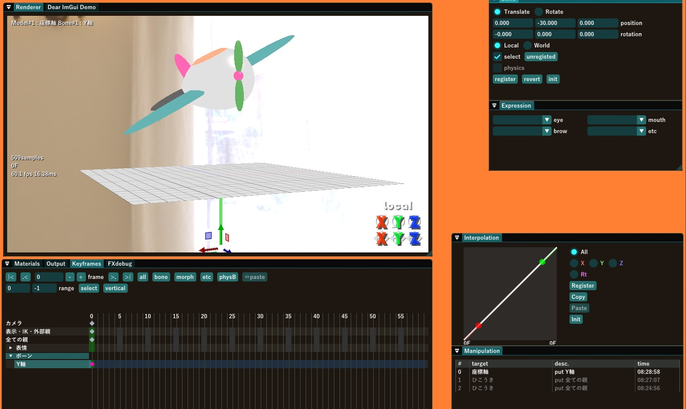

# 第一章 はじめに

この章では、MikuMikuDayoのかんたんな操作方法を説明します。

全機能を網羅するようなガイドは読む方も書く方も辛い物になるので、あくまで最初の一歩という範囲に絞って書きました。

基本的な操作方法自体はウィンドウの内容がだいたい英語になっている点を除けば、おおむね本家MikuMikuDanceと揃えて作ってあるつもりですから、本家に詳しい人は、この章は読み飛ばしても特に問題ないと思いますが、最後の方の[表情モーフの操作](#表情モーフの操作) と [動作モード](#動作モード)については読んどいてもいいと思います。

## 操作方法を見る

まず、画面上の`Help`メニューから`ショートカット一覧`をクリックすると、キーボードによるショートカット一覧を表示できます。

これは役立つのでキーボードによる操作法を思い出したい時はちょこちょこ見てください。

このダイアログは`close`ボタンを押すか`ESC`キーで閉じることが出来ます。

## モデルの読み込み

エクスプローラからMikuMikuDayoに`PMX`モデルをドラッグアンドドロップするとモデルを読み込みます。

`MikuMikuDayo/sample`フォルダに`ひこうきインパルス.pmx`というファイルがありますから、それを読み込んでください

こんな風になんかよく分からない丸っこいモノが出現しました

## Rendererウィンドウでの視点の操作

`Renderer`ウィンドウでモデルの位置の調整やカメラの調整などのプレビューを行います。このウィンドウの上で
- 右ドラッグ > カメラを目標地点周りに回転
- ホイールまたはCtrl+マウスの前後移動 > カメラの距離調整
- 中央ドラッグ > カメラの目標地点を平行移動

カメラの目標地点などについての詳細は後でカメラの操作についての項目でやりますので、とりえあえず今は**マウスの右・中央ドラッグ＆ホイールを回すとなんとなく視点が動く**と分かればOKです

マウスによる操作をもっと早くしたいとか遅くしたいと感じる場合はCtrlを押しながら動かすと1/10倍速になり、Shiftを押しながら操作すると10倍速になるのでご活用ください。

てきとうにうごかしてひこうきの全体が見えるようにしてみましょう

テンキーでカメラの位置を素早く正確に変える事も出来ます(`ショートカット一覧`を参照してください)。3Dの`Renderer`ウィンドウでは奥行きが正確に分かりづらい事もありますから、空間上での正確な位置あわせにはテンキーで違う視点からの見た目も併せて確認すると捗ります。

さて、これだけでは地面からの高さとか大きさとかが良く分かりませんから、同じく`sample`フォルダにある`座標軸.pmx`も読み込みましょう。

ひこうきが地面にめりこんでおります。これはモデリングがマズいのではなく、あえてこうなっているんです。ほんとうです。

## モデルの選択

ひこうきが最初から墜落どころか地面にめり込んでいては恰好が悪いですね。なんとかひこうきを空に浮かべたいです。

今はシーン内にひこうきと座標軸で2つのモデルがあります。ここからはひこうきを動かしながらモデルの移動や回転などについてみていきたいですが、操作の対象は後で追加したモデルである座標軸になっています。

`Models`ウィンドウで操作対象のモデルを変更できます。モデル以外にカメラ・照明を選択する事も出来ます。

`model`コンボボックスで`ひこうき`を選択してください。

ところで、**model**と書いてあるラベルのちょっと右に`(?)`マークがあります。ここにマウスカーソルを合わせると、いつでもモデルをドロップした時の説明を読むことが出来ます。ご活用ください。

## モデルを動かす = ボーンを動かす

モデルは通常、複数の**ボーン**を持っています。ボーンというのはここでは**なんか操作できる物**程度に思ってもらって差し支えないんですが、各ボーンの位置や向きを変えることでモデル全体、あるいは手だけ、足だけなど一部の状態を変える事ができます。

モデルの持っているボーンの一覧がどこに表示されているかというと、`Keyframes`ウィンドウです。デフォルトの状態だと`Renderer`ウィンドウの下に表示されていますが、`Renderer`ウィンドウの下のウィンドウはいくつかのウィンドウをタブでまとめた物になっているので、`Keyframes`ウィンドウは隠れた状態になっているかもしれません、その場合は`Keyframes`タブをクリックして`keyframes`ウィンドウをアクティブにしてください。

この左の列がボーンとその他の情報の一覧になっています。デフォルトの状態では`全ての親`がハイライトされている状態になっているでしょう。そうで無い場合は`全ての親`を左クリックして選択してください。

こうすると、`全ての親`ボーンを操作できる状態になります。最近の大体のモデルは`全ての親`ボーン、無い場合は`センター`ボーンを操作するとモデル全体の移動・回転を行うことが出来ます。

ひこうきは2つしかボーンがなく、1つは物理ボーンといって基本的にユーザーからの操作ではなく物理演算によって自動操作されるボーンですから、実質1つしかボーンの無いシンプルなモデルですから、操作できるボーンは`全ての親`だけと思ってよいです。(物理ボーンなどについての詳細は後の章で取り扱う予定です。)

## ボーンの選択

ここで、ボーンを選択する方法について説明しときましょう。

ひこうきの場合は実質1個しかボーンが無いのでちょっと物足りないかもしれませんが、1個でも複数でも操作自体は一緒です。

今の状態ではボーンが1個だけ選択された**ボーン操作モード**になっています。ボーン操作モードではボーンの位置に**ギズモ**という3つの矢印などが表示されていて、そこをドラッグするなどしてボーンの位置・姿勢を操作できるモードになります。ボーンの操作法についてはすぐ後でやります。

この状態から`ESC`キーを押すとボーンの選択が解除され**ボーン選択モード**になります。

ギズモのあった位置にボーンの位置を示す四角印と向き・大きさを示す三角形の描かれたマーカーが表示されます。マーカーの四角をクリックするとそのボーンを選択してボーン操作モードにまた戻れます。

マーカーが現れない場合は`Bone`ウィンドウの`select`チェックボックスまたは`C`キーを押してボーン選択onにしてください。offにするとボーン選択モードでのマーカーを非表示にしてモデルのキーフレームを編集している時でもどのようにモデルがレンダリングされるのかを観察できます。

全ての親ボーンが選択され、ボーン編集モードにした状態に戻して、ボーンの操作の説明に進みましょう。

## ボーンの操作

モデルの位置や姿勢を変えるには3通りの方法があります

1. ギズモをマウスで動かす
2. Rendererウィンドウ右下にある、操作パネルで動かす
3. 位置・姿勢を直接入力

### ギズモによる操作

ひこうきの中央に表示されている矢印を**ギズモ**といいます。ギズモはモデルの操作中のボーンの位置に表示されています。デフォルトでは`全ての親`ボーンだけが選択された状態になっており、`全ての親`ボーンの操作を行う事でモデル全体の位置・姿勢を決める事になります。

1. 矢印を左ドラッグするとその軸方向にだけ動く。R,G,Bの順にX,Y,Z方向に対応
2. 四角い(菱形の？)つまみを左ドラッグするとその平面に属している方向にだけ動く
3. 中央の白丸を左ドラッグすると各方向に動く

よく見ると矢印には | | | | | という感じの黒いギザギザが入っている事があります(上の図ではX軸とZ軸に入っています)黒いギザギザが入っている場合は軸のマイナス方向を表しています。これは四角いつまみをいじりやすくするための工夫です。

MikuMikuDayoの座標系は本家MikuMikuDanceで採用されている左手系、カメラにとってはX+が右 Y+が上 Z+が前方 になる座標系を採用していますが、慣例的にモデルはZ+を後方として作られ、初期の位置・姿勢をとったカメラとモデル同士は相対するようになっています。

(余談ですが、本家MMDは青矢印が手前方向を指しているので一見右手系に見えるのですが、座標を読むと青矢印がZ-方向を指しているので間違いなく左手系だったりします。「モデルにとっての前方」を青矢印の方向に採用しているのでしょうか)

ひこうきを上に動かしてみましょう。緑の矢印をドラッグしてBoneウィンドウの`position`パラメータが0,40,0付近になるまで動かしてください。

動かしたらBoneウィンドウ左下の`register`ボタンまたはキーボードの`enter`キーを押すとKeyframesウィンドウの`全ての親`の真右のキー(🔶)が赤紫色になるはずです。

もし、Keyframesウィンドウが表示されていない場合は、左下のウィンドウ群の中に隠れているかもしれません。その場合はKeyframesタブをクリックして、Keyframesウィンドウが表示されるようにしてね。

キーフレームに登録せずに編集対象フレームを変更すると、ボーンの移動など編集内容は破棄されて、移動後のフレームの内容になりますのでご注意ください。

このようにキーを登録する作業を行う事で、フレーム番号0の絵が出来たということになります。おめでとう！未来の偉大なアニメーション作家の第一歩！でんせつのはじまり！

アニメーションを作る各フレーム(コマ)の事を**キーフレーム**と呼び、キーフレームを作るための個々のボーンの位置・姿勢などの状態を記録したデータ1個をMikuMikuDayoでは**キー**と呼びます

(余談ですが、本家MMDではキーの事は**フレームポイント**というのが正式な名称のようですが、デファクトスタンダードを考えると**キー**でいいじゃないかという事でMikuMikuDayoでは簡潔に**キー**と呼ぶことにしました)

移動の仕方が分かったところで、回転もさせてみましょう。

キーボードの`X`キーを押すか、Boneウィンドウの`Rotate`というラジオボタンをクリックして、回転モードにします。

回転モードにすると、ギズモが円に変わります。

1. 赤/緑/青の円を左ドラッグするとX/Y/Z軸周りに回転します
2. 白い円を左ドラッグするとカメラの正面軸周りに回転します

とりあえず青い円をドラッグしてZ軸周りに30度くらい回して、さっきと同じようにBoneウィンドウで`register`ボタンを押して登録しましょうか。

平行移動モードに戻す場合は`Z`キーを押すか、Boneウィンドウの`Translate`ラジオボタンをクリックしてください。

### ギズモのコンテキストメニュー

ギズモを右クリックするとコンテキストメニューが開きます。

各メニュー項目をクリックすると以下のような機能を実行できます

1. register : 現在の状態でキーを登録する
2. revert : 登録済みの状態まで操作中のボーンの状態を巻き戻す
3. init : ボーンの状態を初期化する

`Bone`ウィンドウにも同じボタンがありますが、それぞれ同じ機能です。

### Rendererウィンドウ右下にある操作パネルによる操作

Rendererウィンドウの右下のX,Y,Zと書いてあるところを**操作パネル**と呼びます。

カメラとの位置関係によってギズモでは操作しづらい場合などに使います。

というか、以前からMMDを使っている人だったらここばっかりいじってたかもしれません。ギズモは背景に家具を設置する時などモデリングの延長上にある使い方をしますが、操作パネルはギズモが隠れていてもカメラを動かさなくていいのでモデルにポーズを取らせる時などに威力を発揮します。

マウスの右ボタンをダブルクリックすると、マウスカーソルが操作パネルにジャンプします。この状態でさらに右ボタンをダブルクリックすると`Keyframs`ウィンドウのボーン一覧の所にマウスカーソルが動きます。

1. 上段のX/Y/Zの上にマウスカーソルを置き、左ボタンを押して上下にドラッグすると各軸方向に回転
2. 下段のX/Y/Zの上にマウスカーソルを置き、左ボタンを押して上下にドラッグすると各軸方向に移動
3. Localと書いてあるところを左クリックでWorldと切り替え、もう一度押すとLocalに戻る(キーボードの`L`キーまたは、BoneウィンドウのLocal,Worldラジオボタンでも可)

#### Local/Worldモードとは

どの座標系を基準に移動・回転を行うのかという違いがあります
- Localモードでは選択しているボーンの座標系を基準に操作をします。ひこうきの現在の状態のように、ボーンが傾いた姿勢をしている場合、ギズモの矢印の向きも傾いています
- Worldモードではワールド座標を基準に操作をします。ひこうきの向きによらず、ギズモの矢印の向きはワールド座標の向きと一致します

### 数値の直接入力によるモデル操作

Boneウィンドウの`position`の左の3つの数値のどれかをクリックすると数値を直接入力してモデルの位置を変更できます。左から順にX/Y/Z座標の値です。

位置の単位は**MMD長さ**という単位で歴史的な経緯があって設定されている物ですが、1MMD = 8cm程度と言われています。MikuMikuDayoではこの主張を支持し、1MMDは厳密に8cmと等しい事を前提にお話を進めます。

同様に、`rotation`の左の3つの数値のどれかをクリックすると数値を直接入力してモデルの姿勢を変更できます。こちらは通常通り360°系で、左から順にX/Y/Z軸周りです。

## モデルとボーンの選択

今まではひこうきの`全ての親`ボーンの操作についてのみ説明をしていましたが、モデルごとに複数のボーンを持つ場合がほとんどです。

まず、さっきドロップしたもう一つのモデル、座標軸モデルに操作対象を切り替えましょう。

Modelsウィンドウの`model`コンボボックスで`座標軸`を選択すると、座標軸モデルを操作対象として切り替えられます。Tabキーを押すと順送り、Shift+Tabで逆送りで切り替える事も出来ます。

座標軸に刺さっている緑のY軸は何気に動かすことが出来ます。これを地面の下にでも隠そうと思います。

Keyframeウィンドウの左にカメラ、表示・IK・外部親、表情、ボーンと書いてある列があり、現在は`全ての親`がハイライトされています。これは`全ての親`ボーンを選択して操作できる状態にあるという事です。

`ボーン`の左にある三角印をクリックすると、その下の`Y軸`という項目が現れるので、`Y軸`のところをクリックしてハイライトさせましょう。すると、今後は`Y軸`ボーンを操作の対象と出来ます

`Y軸`ボーンを操作して、地面の下に動かして、`register`ボタンで登録しましょう。これで緑のY軸はカメラが地面の上に有ればとりあえず見えなくなります。

ヨシヨシ、ひこうきが飛びあがり、邪魔そうな棒も隠れました

次は、ひこうきが飛んでいくようにアニメーションをさせたいですよね。

## かんたんなアニメーション

キーボードの右矢印を繰り返し押すか、Keyframesウィンドウの右上の`frame`という入力欄に`30`と入力し、編集対象のフレームをフレーム番号30にします。

フレーム番号を以降`F`と略記し、30Fと書いたらフレーム番号30の事だと解釈してください。

この**フレーム番号**でアニメーションの何コマ目を編集しているのか？という事を指定します。MikuMikuDayoでは1フレームあたりの表示期間は1/30秒で固定されており、開始フレームは0Fですから、フレーム番号を30で割れば簡単に「今編集中のフレームは再生開始の瞬間から何秒の時点での絵なのか？」という事が分かります。

次に、Modelsウィンドウで操作対象を`ひこうき`に切り替えて、全ての親ボーンをZ軸方向に-100くらい動かしてみましょう。その状態で`register`を押すと、30Fにキーが打たれます。

キーボードの左キーを何度か押すとひこうきが後ろに戻っていく様子が見れます。

右に進めるとまた飛行機が前に動きます。

ここで、Animationウィンドウで再生ボタン▶️(またはキーボードの`P`)を押すとアニメーションが再生…されてほとんど何も映ってない状態になります

そうです、カメラのキーフレームを登録していないからです。

0Fに移動してからModelsウィンドウで`Camera/Light`を選択してカメラを操作するモードにしましょう。

## カメラの操作

カメラの操作をおさらいすると、`Renderer`ウィンドウで

- 右ドラッグ > カメラを目標地点周りに回転
- ホイールまたはCtrl+マウスの前後移動 > カメラの距離調整
- 中央ドラッグ > カメラの目標地点を平行移動

でした。今回はカメラを操作するモードになっていますから、カメラについてのパラメータが`Camera`ウィンドウに表示されています。その情報について補足しておきます。

カメラの目標地点は`Camera`ウィンドウに書いてある`target`という値です。カメラそのものの位置ではなくカメラが見ている**目標位置**である点に注意が必要です。

`distance`で示されるカメラの距離とは目標位置からカメラまでの距離を表しています。距離という事はマイナスの数値にはならないので、ホイールをいくら上方向に回してもそれ以上カメラが前に進まなくてイライラする事があるかもしれません。これはホイール操作でカメラを前後に動かしているのではなく、目標位置までの距離を操作しているからです。そういう時はマウスの中央ボタンドラッグを使って目標位置を変える必要があるという訳です。

一人称視点のゲームの主人公の操作のつもりでカメラを動かすとなんだか直感的ではなく感じるかもしれませんが、主人公はカメラではなくて目標地点に置いてある物……ひこうきではあまり嬉しくないかもしれませんが、実際のみんなの作る動画ではミクダヨーさんだったりするわけですから、カメラがその周りを取り巻くように動かす事に適している方が作品作りをしやすいはずです。

さて、本題に戻り、マウスの右・真ん中ドラッグでカメラを動かして、アニメーション全体が納まりそうな位置にカメラをセットし、`register`ボタンでカメラの状態をキーとして0Fに登録しましょう。

ここで再生ボタン▶️を押すと、飛行機が前に進んでいく様子がアニメーションされると思います。

## 表情モーフの操作

プロペラが回っていないのが物足りないのでModelsウィンドウで`ひこうき`を選択します。

`Expression`ウィンドウでモデルのいわゆる表情付けが出来るのですが、ひこうきモデルの場合は`インパルす`という項目が出ています。

`インパルす`という項目の下にあるスライダーをドラッグして、てきとうに増やしましょう。0フレームに移動したままになっているのを確認し、スライダーの右の`register`ボタンを押すとKeyframesウィンドウの表情のキーが赤っぽくなって表情が登録されます。

スライダーではキリのいい数値を入力しづらくて困る場合や0～1を超える範囲を入力したい場合は、Ctrlキーを押しながらスライダーをクリックすると直接数値の入力が出来ます。また、右クリックを押すとデフォルト値に戻すことが出来ます。

ここでアニメーションの再生を行うと、プロペラが回った状態でアニメーションされます！

## 動作モード

`インパルす`モーフなどのように自動的に動き続ける効果のある項目はいじっても再生を押すまで効果が良く分かりません。

動きが見れなくて不便だという場合は、上の`View`メニューの`動作モード`というところの、`ガンガンいこうぜ`を選択してください。Rendererウィンドウの中でも動くようになります。

ここで動作モードについて3つとも説明しておきましょう

- **サンプルためろ** 
BDPTレンダラなどで静止画を作成するためのモードで、物理演算などの動きのある要素を排除してレンダリングを繰り返します。初期状態ではここになっています。
- **ガンガンいこうぜ** 
物理演算などを常時行います。今回のインパルすモーフなどのように動きのある要素のプレビュー込みで編集を行いたい時向けです。
- **でんきだいじに** 
レンダリングも物理演算も必要になった時のみしか行わなくなります。消費電力も少なくなり、UIのレスポンスも良くなるのでわりとオススメです。

## 光源のいじり方

最後に、光源のいじり方について説明しときましょう。

`Models`ウィンドウで`Camera/Light`を選択して、カメラと光源をいじれるようにします。そうしたら、`Light`ウィンドウで光源の色と向きを設定できます。

- `color` 光源の色をR/G/Bで指定します
- `direction` 光線の進行方向をX/Y/Zで指定します

ここで設定できる光源は平行光源といってシーン全体をまんべんなく照らす光です。この設定によって実際の見た目にどのような影響が出るのかというのは第二章で説明する、レンダラの実装によって変わってきます。例えばBDPTレンダラでは平行光源自体サポートしていない(する必要が無い)のでこの項目をどう設定しても見た目に変化が無かったりします。

てきとうにいじったら`register`ボタンを押すとキーフレームの`照明`の行に光源の状態を保存できます。

## まとめ
以上で第一章は終わりです。第一章では基本的な操作方法として

- キーボードショーカット一覧の表示
- モデルの登録と選択
- ボーンの操作
- キーの登録
- カメラの操作
- アニメーションの最初のステップ
- 表情モーフとスライダーの操作
- 動作モードの変更
- 光源の設定

について説明しました。