# 第二章 見た目をよくする

せっかくなら見た目のいい動画を作りたいですね！

基本的な操作について掴んだところで、ここからは見た目をよくする方法について説明します。

繰り返しになりますが、CG、MMD界隈の一般的な用語についてはいちいち説明すると膨大な量になります。わざと説明は省いているので分かんない場合は各自お手元の調べる道具で調べてくださいね。

## レンダラの選択
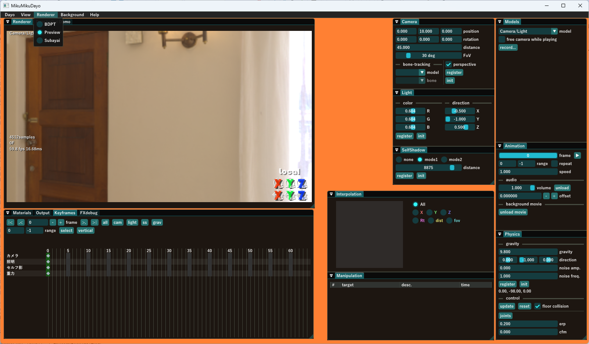

まず、`Renderer`メニューから使用するレンダラを選択します。

MikuMikuDayoにおけるレンダラとは、物体を画面に描くエフェクトの事です。MikuMikuDayoでは1つのレンダラで全部のモデルを描くので統一感のある見た目が得られます。

今のところ、同梱されているレンダラは以下の3つです。

- Preview<br>
動作チェック用の最低限の実装のレンダラです。レンダラを自作したくなった時のサンプルとしての役割もあります
- BDPT<br>
双方向パストレーシングを用いたレンダラです。作画ソフトというより光輸送シミュレータに近い物であり、きわめてリアリスティックで高品質な絵を作れますが「融通がきかないので作画上のウソをつけない」「作画に時間がかかるので動画の作成に向かない」といった欠点もあります
- Subayai<br>
ラスタライザとレイトレーシング混成の名前通り素早いレンダラです。PBR風の絵が得られますがトゥーン調のシェーディングも可能です

「大体MMDで出来てた事」を見た目をよくしつつやりたいでしょうから、このチュートリアルでは`Subayai`を選択します。ちゃんと動くかな？

初めてエフェクトを読み込む時に**コンパイル**といって、レンダラなどのエフェクトを記述してある`.fxdayo`ファイルに書かれた情報からビデオカードが読み込んで実行できるように変換する作業をするため、時間が多少かかりますが、2回目以降はコンパイルした結果を使いまわすので早く起動できます。コンパイルした結果は`MikuMikuDayo/shadercache`フォルダに保存されるので、もしもエフェクト関係で怪現象に悩まされた時は一度shadercacheフォルダの中身をクリアしてみる、というのも一つの手段として覚えとくといいかもしれません。


## モデルの読み込みと配置

第一章と同じく、`ひこうき`と`座標軸`を読み込みましょう。別にひこうきの見た目を良くしなくても…という人は、ひこうきじゃなくて好きなモデルを借りてきてもいいです！座標軸も何か気の利いた背景モデルを借りてくればいいよ！ぼくが自作したので諸々気にせず好きに扱えるモデルだからひこうきと座標軸を例にしてるだけなので、はい。

ともかく`sample/ひこうきインパルス.pmx`と`sample/座標軸.pmx`をエクスプローラからドラッグアンドドロップして読み込んだら、てきとうに配置しましょうか。

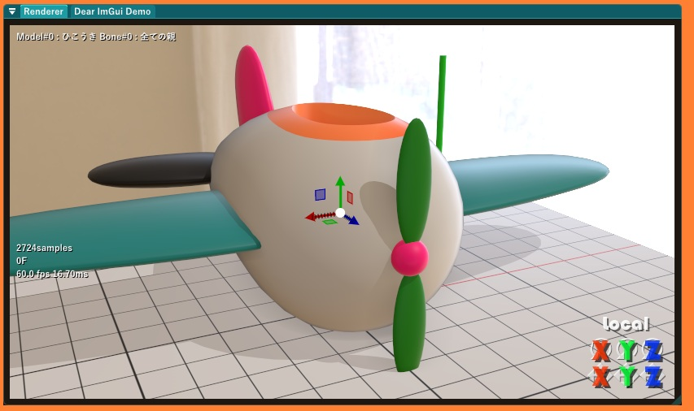

ひこうきは地面に置いてある感じで、Y軸も刺さってたらなんかカッコわるいので横にずらして置いときますか、こんな感じで。動かし方が分からない人は第一章を読み直してね。

## とても大事なトーンマッピング

今の時点でも第一章とはちょっと雰囲気の違う見た目になってると思いますが、この状態では実は**色が無茶苦茶**です。トーンマッパーを入れて**トーンマッピング**を行うことで正しい色が表示されるようになります。

`postprocess/ToneMapper/ACESTonemap.pmx`を読み込むと、このように、見た目の雰囲気が微妙に変わります。トーンマッピングをする前はカーテンの向こうの景色がほぼ完全に白飛びしてつぶれていますが、トーンマッピングをするとカーテンの向こうの景色もおぼろげに分かるようになりました。つまり、**絵の情報量が飛躍的に上がる**のです。

気を付けていただきたいのは、まだこの段階では照明も何もいじってないので色合いの好みの問題などはまだ全く反映しようがないという点です。今この絵を見ただけで「トーンマッパーを入れたから色が好みになってないのでトーンマッパーは入れない」という決定を下すのは明らかな誤りです。まずトーンマッパーありきと心得よ。

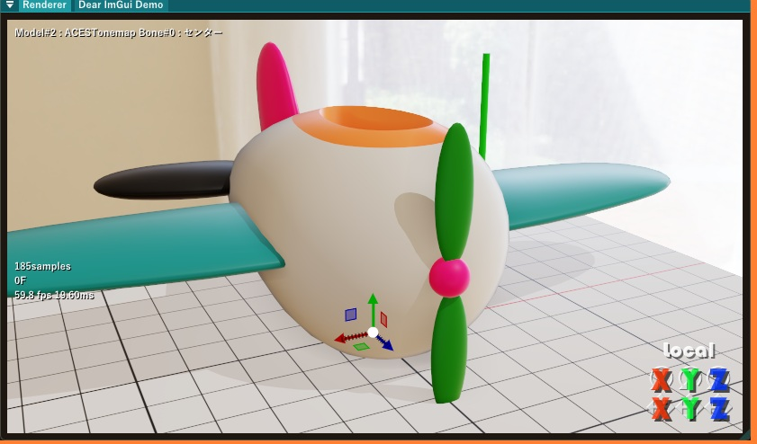

こういうレンダラの描いた絵に対して後処理を加えるエフェクトを**ポストプロセス**といいます。後で説明するようにMikuMikuDayoには多くのポストプロセスが`postprocess`フォルダに同梱されているため、多彩な表現を簡単に行えます。

トーンマッパーのような大事な物がなんでレンダラに内蔵されてないのかというと、トーンマッピング前の状態を想定して作られているポストプロセスと、そうでないポストプロセスという物があるのでしょうがないんです。ポストプロセスは掛ける順序が大事になってきます。

トーンマッピングに興味を持ってご自身で詳しく調べようとする方向けの情報ですが、MikuMikuDayoのレンダラは必ずsRGBリニア色空間で画像を出力します。レンダラの後のポストプロセス群にはsRGBリニアで書かれた輝度データが渡り、トーンマッピング後の時点では輝度1.0以下の画素のみになりますがガンマ補正はされません。ガンマ補正は全てのポストプロセスが完了した時点でMikuMikuDayoの内部で画面への出力の直前に行われます。

## すばやい蓮根
Subayaiの設定をかんたんにいじれるようにコントローラが入っています。`renderer/Subayai/subayairencon.pmx`を読み込みましょう。Subayai renderer controller略して**すばやい蓮根**です。

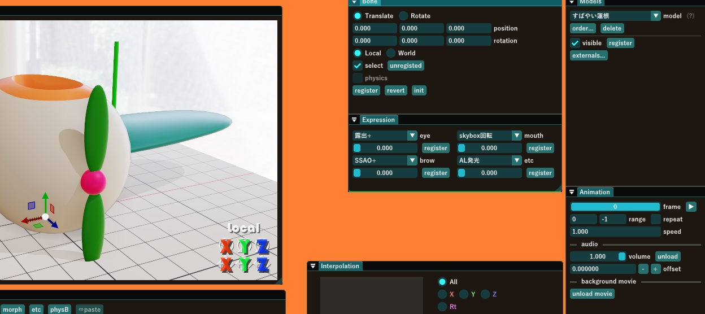

表情モーフのスライダーをいじると画面の明るさなどをいじれます。


## 床をレンガにする

モデルと、絵作りに必須の2つの道具を入れた所で、次は**マテリアル**(MatDesc)の変更法について説明します。

`Renderer`ウィンドウの下にある`Keyframes`ウィンドウなどの入っている窓の集合体から、`Materials`ウィンドウをアクティブにしてください。

このウィンドウでは**マテリアル**と言ってMMDの材質に対して更にレンダラ固有の注釈を入れるためのテキストファイルを材質ごとに設定できます。マテリアルというのは実際には便宜的な名前で、正式名称は**材質注釈**、英語では**MatDesc**と表記しますが、マテリアルと言った方が分かりやすい人の方が多いだろうからマテリアルと呼びます。材質注釈とタイプするのめんどいし。

今回は、座標軸モデルの床のマテリアルをレンガにしてみます。Materialsウィンドウで座標軸の左の三角印をクリックして展開して、`床`の右側の`default.txt`と書いてあるところをクリックして選択します。すると、床が虹色にチカチカするはずです。このマテリアルを変えると床の模様が変わるよ、という事が見やすく伝わるようになっています。

床の材質を選択したら、`load MatDesc`ボタンを押してファイル選択ダイアログを出し、`renderer/Subayai/m/bricks.txt`を設定します。

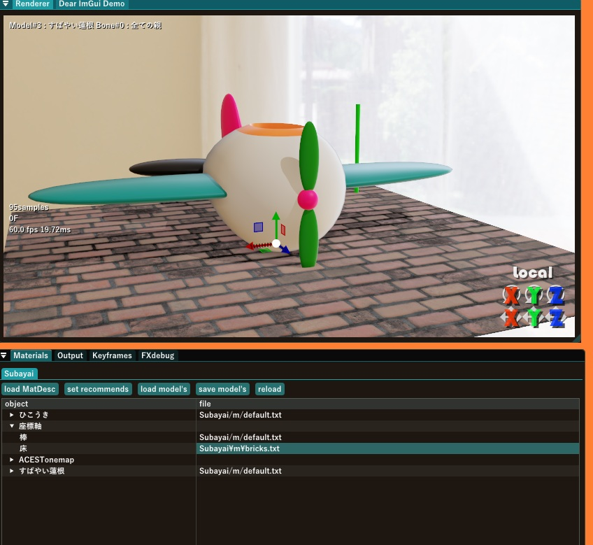

これで床のマテリアルにbricks.txtが読み込まれてレンガ模様になります。

マテリアルは他にも色々あるのでどれを指定するとどんな見た目になるか探すのもたのしいですよ。

マテリアルを自作したくなった場合は`Renderer/Subayai/m/_template.txt`を読んでみてください。Subayaiが扱えるパラメータと意味について全部書いてあります。

注意：材質注釈のファイルはレンダラごとに固有のパラメータが用意されるので、Subayai用材質注釈ファイルとBDPT用材質注釈ファイルでは基本的に互換性がありません。レンダラが違えば物体に対する考え方自体もまた違うからです。

## 光源をいじる

Subayaiでは`Light`ウィンドウで平行光源をいじると影が動いて面白いです。

それだけでも楽しいですが、スポットライトを付けてもっと楽しくできます。

`renderer/Subayai/subalight.pmx`をドロップすると、`ライト`という名前で追加の光源を読み込めます。基本的に点光源ですが、色々いじれる有能な奴ですよ。

とりあえず、最初の状態では床にぽつんと落ちた状態ですから、ひこうきの上にでも移動させましょう。

それから、ライトの効果が良く見えるようにしたいですが、今の状態では全体的に明るすぎます。追加したライト以外暗くしましょう。

`すばやい蓮根`の`環境光-`モーフを上げると背景からの光が弱まり、部屋が暗くなっていきます。さらに、`Light`ウィンドウで`color`のR/G/Bとも下げて、平行光源も暗くしてしまいましょう。この章ではこれ以降平行光源はいじらないので以降「ライト」と言ったら今モデルとして追加したライトの事を指します。

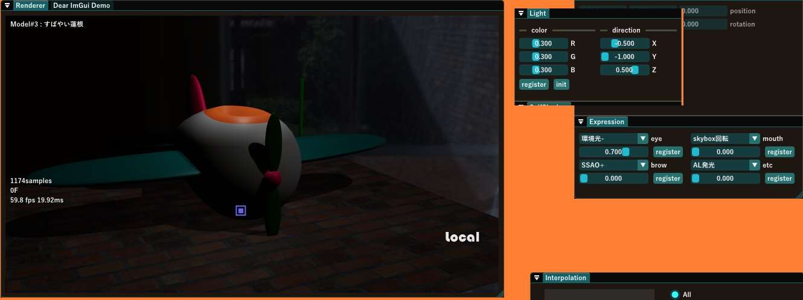

暗くなりました。上からスポットライトで照らしているようにしてみましょう。

`Models`で`ライト`を選択し、`ゴッドレイ`モーフを1にセットしましょう。光から筋が延びて空間を照らす様子が良く見えるようになります。

ここから、`コーン`モーフを上げると、スポットライトのコーンが絞られていきます。光の出る向きはライトのZ+の方向なので、回転させると光の出る方向を変えられます。ひこうきの方を照らすようにライト回転させましょう。

色や明るさを変えるには、`色相` `彩度` `明度`モーフと、`明るく`モーフで行います。`明るく`モーフで大雑把な明るさを指定し、残り3つのモーフで色を整えます。3つのモーフを0から上げていくと以下のように変化します

- **色相(Hue)**  
赤・オレンジ・黄色・緑・水色・青・紫と色調が変化し、1.0まで上げるとまた赤に戻ります
- **彩度(Saturation)**  
色相で指定した色が濃くなります。彩度が0のままでは色相が何であろうと白黒です
- **明度(Value)**  
明るくなっていきます。色相・彩度がいくつでも明度が0ならば黒(照明としての効果なし)のままです

`明度`と`明るく`の二つあるのは奇妙に思えるかもしれませんが、`明るく`モーフは距離の遠いところにある光源から光を届かせるのに都合の良いモーフです。照らしたい物体との距離に合わせて`明るく`でスケールを決めて、`明度`で微調整すると良いでしょう。

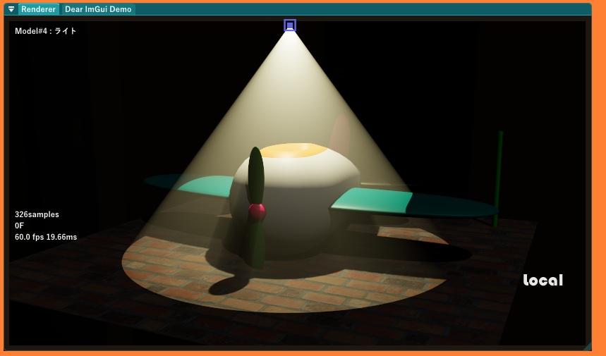

さて、ライトの明るさや色調をお好みに合わせて雰囲気のある照明にしましょう。どうでしょうか？

## ライトのマテリアル

実はライトにもライト用のマテリアルという物が有って、それを割り当てるとライトに色以外の変化を付けることが出来ます。

`Materials`ウィンドウで`ライト`のマテリアルを選択し、`renderer/Subayai/m/light_4x4.txt`を割り当ててみましょう。同梱のマテリアルのうち`light_`から始まるマテリアルは、照明用で、これを割り当てるとライトの配光特性が変わります。

`light_4x4.txt`では光が4*4マスに分かれた形になり、ゴッドレイの筋が細かくなります。もし、光がザラザラした感じが気になる場合はライトの`サンプル数`モーフを上げてみてください。動作は重くなるかもしれませんが、ザラ付きは抑えられます。

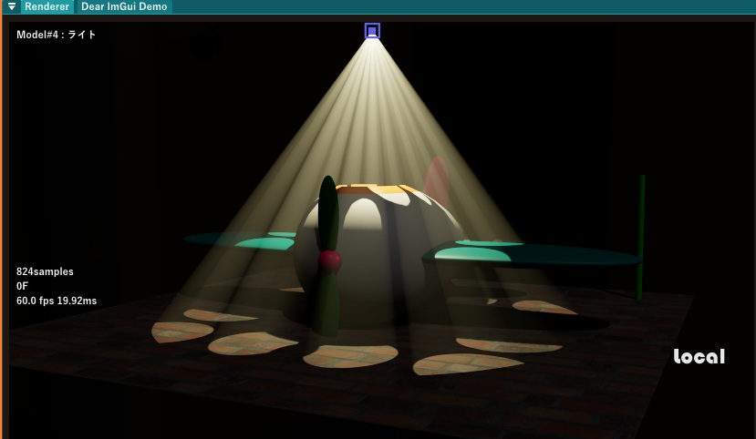

後で説明しますが、編集中にサンプル数が少なくてザラついててもそんなに気にしなくて大丈夫です。動画の見た目を良くするためのパラメータは他にもあります。編集が軽くてサクサク行った方が捗るでしょう。

## ポストプロセスの追加と順序の設定

ぼくがよく使うポストプロセスとしてdiffusionがありますから、ここでそれを追加しましょう。`postprocess/glare/diffusion.pmx`をドロップします。


これは光がぼんやり拡がる感じを出すエフェクトです。光が拡がってる様子を説明したいですから、絵の雰囲気は一旦置いといて、ライトの明るさをちょっと上げました。

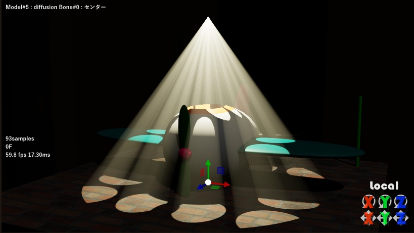
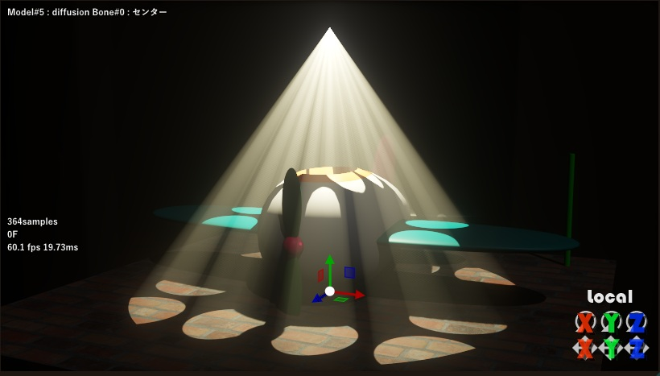

光が拡がって良い感じになりました…  
が、diffusionを読み込んだ時のメッセージを思い出しましょう。

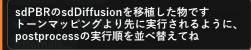

トーンマッピングより先に実行しろ、とあります。ポストプロセスは何も設定しない状態だと読み込んだ順に実行されますから、今の状態ではトーンマッパーが先でdiffusionは後で実行されています。

ここで、`Models`ウィンドウの`order...`ボタンを押すと、このように`Order setting`ダイアログが開きます。

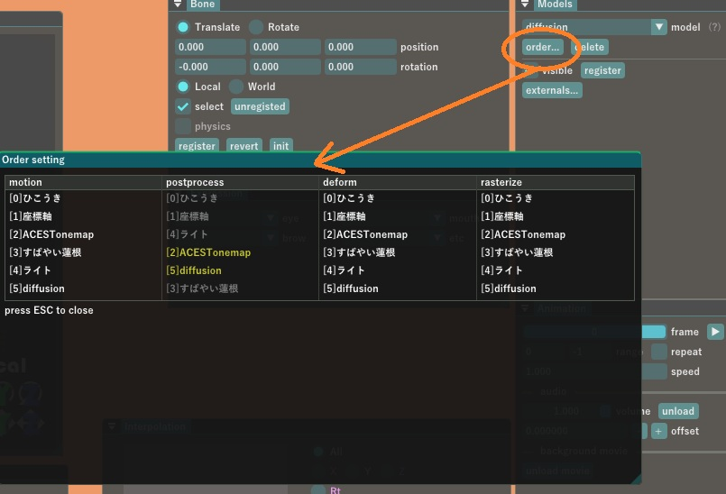

このダイアログは色んな事についての実行順を指定する物となっていて、各項目のいずれも上に置かれたモデルから下に置かれたモデルの順番に実行され、項目をドラッグアンドドロップで順序を変更できます。

- **motion** モーションの計算順。キーフレームの情報からポーズを確定する計算です。
- **postprocess** ポストプロセスの実行順です。今回はここをいじります。
- **deform** デフォーマの実行順です。デフォーマについてはエフェクト作成の手引きの項目で説明します。
- **rasterize** ラスタライザによる描画順です。半透明合成の順序はここの影響を受けます。

今回はポストプロセスの実行順ですから、**postprocess**の列を見ましょう。このうち黄色くハイライトされているモデルがポストプロセスの起動元となるモデルで、この順序をいじればよく、灰色で表示されているモデルはポストプロセスとは関係ないモデルなのでこのダイアログ上でいじっても特に意味がありません。

diffusionをドラッグしてACESTonemapより上に持っていきましょう。すると、diffusionの方が先に実行されるようになります。

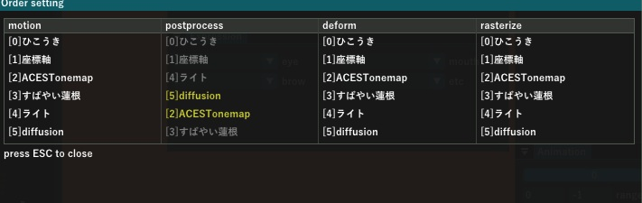

そうしたら`ESC`キーを押してダイアログを閉じます。

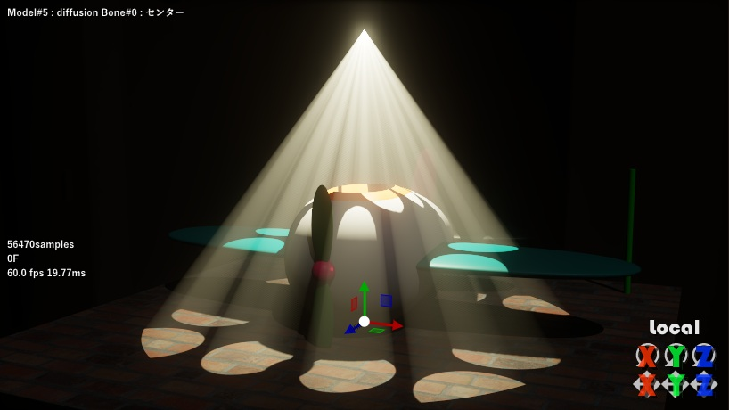

すると、このように先ほどより光の広がり感が強まります。特にライトの根元より強い光が出てくる様子が強調されて良い感じですね。

これはどういうことかというと、トーンマッピングをすると輝度が1より大きい部分は輝度1以下に落とし込まれるからです。トーンマッピングの前に実行しないと元々の輝度は分からないのでdiffusionは正しく動作しないことになります。

トーンマッピング前の元々の輝度を基準に動作をさせる必要のあるポストプロセスと、トーンマッピング後の1.0以下の輝度情報しかない状態で動作させる必要のあるポストプロセスがある、というのは慣れないと分かりづらい所ではありますが、仕方のない所なので同梱のポストプロセスの説明には必ずその旨が書いてあります。

## ライトを回転させるアニメーションを作る
今回はアニメーションの出力まで説明しようと思いますから、簡単なアニメーションも作りましょう。

光はライトのZ方向に出ていますから、ライトをZ軸まわりに回転させると光の筋がグルグルまわって面白いです。ライトを選択して、1000Fくらいの所にZ軸まわりに150°回転したキーを打つと、光の筋がゆっくり回転するアニメーションになります。

ついでに1000Fの所に色相モーフも数値の直接入力(スライダーをCtrl+左クリック)で10くらいの値を入れときましょうか。光の色が虹色に変化します。

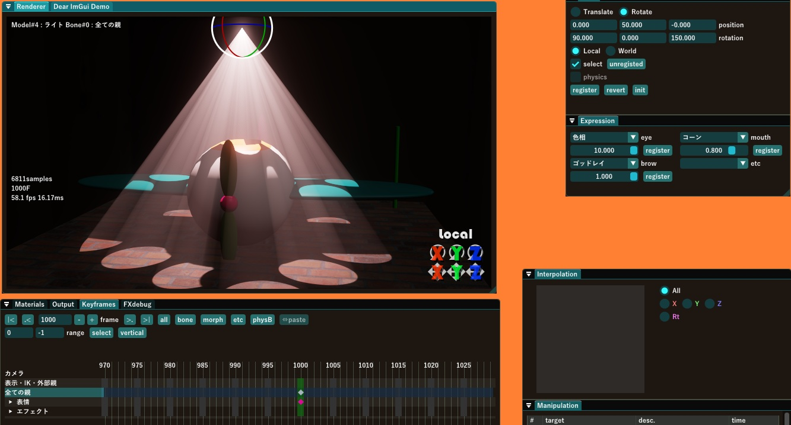

ところで、回転速度をもうちょっと速くしたいと思って270°とかにすると逆方向に90°だけ、余計にゆっくりまわるようになってしまいます。これはどういうことかというと、**ボーンの姿勢は角度(オイラー角)そのままではなくクォータニオンに変換されて管理されているから**です。難しくなってきたな？このおかけで元の姿勢によらず滑らかな回転の補間ができるわけですけど、常に球面上で最短経路を通るよう補間します。

つまり、0Fのキーに0°、1000Fのキーに150°を指定した時は、1000F掛けて150°回りますが、0Fのキーに0°、1000Fのキーに270°を指定すると反対方向に90°回るようになります。

ですから、1回転させようと思ったら0°、120°、240°、0°と4つのキーを打つ必要があります。n回転なら3n+1個のキーです。0°、180°、0°では回転ではなく右回り180°→左回り180°というように途中で反転する可能性があります。

ちなみに、カメラについては姿勢はオイラー角そのままで管理されているので、0°と1080°のキーを打つと2つのキーだけで3回転してくれます。え、なにそれ、ボーンもそうしてよって一瞬思うじゃないですか？カメラは仮にジンバルロックが発生するようなケースがあっても手動で避ける事はある程度できますが、一般的な人体モデルの場合、ボーンの方は多段階の親子構造があったりIKや物理など色んな要素に基づいて実際の姿勢が決まるので、手動でジンバルロックを回避するという芸当はほぼできないです。

ボーンの姿勢がクォータニオンで管理、カメラはオイラー角で管理という二重体制になっているのはまさに設計の妙であり樋口M氏の慧眼なのです。

## アニメーションの出力
アニメーションさせるためのデータが出来た所で、どうやって動画を作るのか説明しましょう。

動画の出力は`Output`ウィンドウで行います。デフォルトの状態だと`Keyframes`ウィンドウなどが入っている窓のタブにまとまっていますので、`Output`タブをクリックして`Output`ウィンドウをアクティブにしてください。

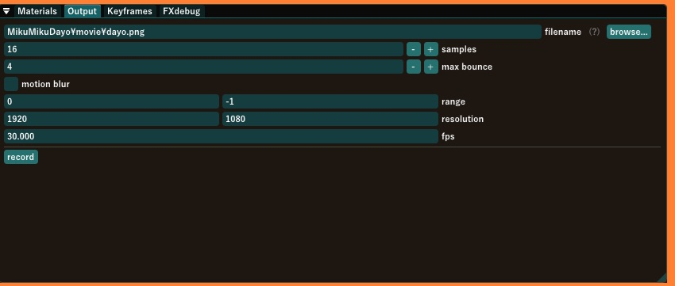

`record`ボタンをクリックすると`MikuMikuDayo/movie/`フォルダに`dayo00000.png～dayo01000.png`として連番のpng画像ファイルが保存されます。

動画に直接出力すると途中でMikuMikuDayoがクラッシュしたら最初から出力しなおしになってしまうので、安全を考えてこういう事になっています。出力に時間はかかるし容量も食いますが安全第一！ヨシ！

というわけで以上！

と言いたいところですが、このウィンドウで設定できることについて説明しときます。意外とこのウィンドウだけで動画の品質はさらに上げ下げできますよ。

- **filename**  
出力先のフォルダ・ファイル名を指定します。ファイル名の拡張子には現在`.png` `.jpg` `.dds`のどれかを指定できます。pngはαチャンネル付きで可逆圧縮ですが出力に時間がかかり容量も食います。jpgは速くて容量も食いませんから、ひでぇ画質のSNSにちょっと投稿するとかだったらjpgでも十分です。
- **samples**  
Subayaiには出力の際に何回か描いて平均を取ることで滑らかな出力を得る機能があります。デフォルトの16はかなり慎重というか多い気がするので4～8でも十分です。ゴッドレイのザラつきが気になる場合は増やしてもいいでしょう。
- **max bounce**  
Subayaiからは現在の所、特に使われません。BDPTの場合はレイトレースする際に何回の反射まで追うか？という情報として使われます。
- **motion blur**  
samplesに応じて複数回レンダリングする際に、1回ごとにモーションと物理演算の更新を行うようにすることでモーションブラーを掛けます。出力の時間は伸びます。
- **range**  
出力するフレーム番号を指定します。左の数字が出力開始フレームで、右の数字が出力終了フレームです。終了フレームに-1を書くと、最後にキーが打ってあるフレームを意味します。
- **resolution**  
出力する画像の解像度を指定します
- **fps**  
出力する動画が何fpsなのか指定します。MikuMikuDayoからは連番の静止画として出力されるので、動画編集ソフトに読み込む際に、ここで指定したfpsと同じになるように読み込んでください

## オマケの1ClickMovie
出力が終わると、このように連番の画像ファイルが出力先フォルダに並びます。

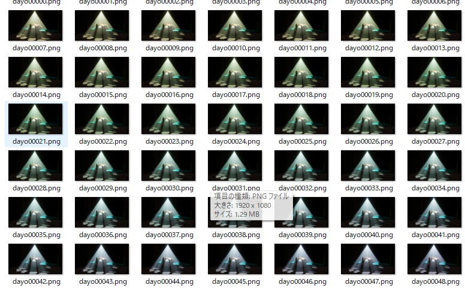

通常は連番になったファイルをAviUtlなどに読み込んで歌詞やセリフを入れて動画として仕上げる訳ですけど、SNSなどにちょっとアップロードするのにもいちいちその作業やるというのはめんどいでしょう。

`tool/1ClickMovie.exe`として同一フォルダにある画像ファイルをファイル名順に結合して`mp4`ファイルを作るツールが同梱されているので、それを動画の出力先フォルダにコピーしてください。

あとは`1ClickMovie.exe`をダブルクリックして起動すると連番画像ファイルから`1ClickMovie.mp4`というファイルが作られます。

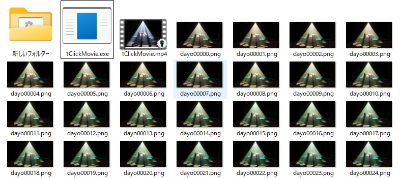

出来上がった`1ClickMovie.mp4`を見てみましょう。

どうかな！？

<video src="g/subamovie.mp4" controls="true"></video>


画質の調整は出来ないんですが、30fps以外の動画が全く作れないと困るので、コマンドラインオプションでfps数を指定するとそのfpsの動画も作れるようにしました。

```
1ClickMovie 60
```

例えば、↑のテキストを`_60fps.bat`という名前で保存して動画の出力先フォルダに保存しておくと、`_60fps.bat`をダブルクリックで60fpsで動画を出力できます。

## まとめ
以上、お疲れ様でした。第二章では
- Subayaiレンダラの選択とすばやい蓮根
- ポストプロセスの追加と順序の設定
- トーンマッピングは必須である
- マテリアルの変更方法
- ライトの追加とライトのマテリアル
- アニメーションの出力
- 1ClickMovieでmp4ファイルを作成

について説明しました。
