# 第三章 作業が捗る

前のふたつの章でごく基本的な操作法について説明しましたが、実際に動画を作ろうとすると今までの知識だけでは非常に効率が悪いでしょう。この章ではもうちょっとMikuMikuDayoの機能を使いこなすガイドをやります。

## 準備

MikuMikuDayoを起動したら、これまで同様、`ひこうき`と`座標軸`を呼びましょう。`sample/ひこうき.pmx`と`sample/座標軸.pmx`をドロップして読み込みます。

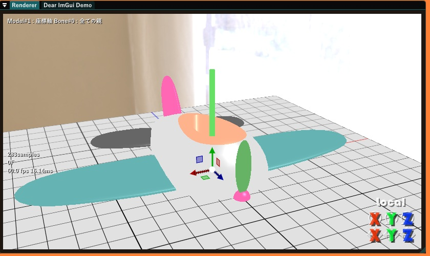

サンプルがひこうきと座標軸しかないのでどうにも見た目がいまいちですが、さすがにもう第三章ですから、みんなはきっと好きなモデルやかっこいいダンスモーションを読み込んで好き放題やって遊びながら、書いてある事はてきとうにアレンジしてたのしく学習してくれている物と信じています。いい加減なチュートリアルもあったもんだ。

## 棒を載せたひこうき

ひこうきに何かを載せて飛びたいと思う事があるかもしれません、そうでなくても作品を実際に作ろうとすると、**あるモデルの動きにくっついてもう一つのモデル(またはその一部)が動く**という動作をさせたい事は多々あります。

これを実現するのにひこうきと載せている物体両方のキーをそれぞれ打つのはいかにもめんどうですから、そこをなんとかするための仕組みが**外部親**です。

今回は、ひこうきに座標軸のY軸に当たる緑の棒を載せて飛ばせてみたいと思います。

`Models`ウィンドウで`座標軸`を選択し、`externals...`ボタンを押すと、このように外部親設定ウィンドウがでます

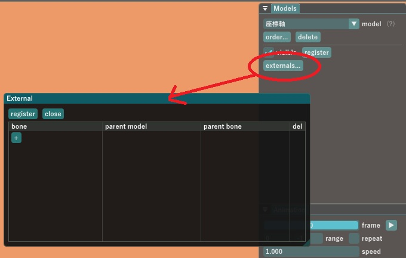

`+`ボタンを押して新しい外部親についての情報を作成します。

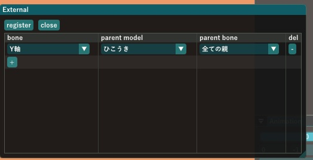

テーブル左から**bone**の項目で`座標軸`のどのボーンに対する**外部親**を設定するのか指定します。今回は`Y軸`ボーンです。

**parent model**と**parent bone**で外部親になるモデルと、そのうちどのボーンなのかを指定します。今回は`ひこうき`の`全ての親`ボーンを指定します。

1つのモデルについて外部親の設定は複数(各ボーンについて最大1つ)行うことが出来ます。テーブルの右端に表示される`-`ボタンを押すと既に設定してある外部親情報を削除できます。

以上の設定をして`register`を押すことで、`座標軸`モデルの`Y軸`ボーンは、`座標軸`の全ての親ボーンの子ではなく、`ひこうき`の全ての親ボーンの子になり、`ひこうき`を`全ての親`ボーンで動かすとY軸の緑の棒も一緒にくっついて動くようになります。

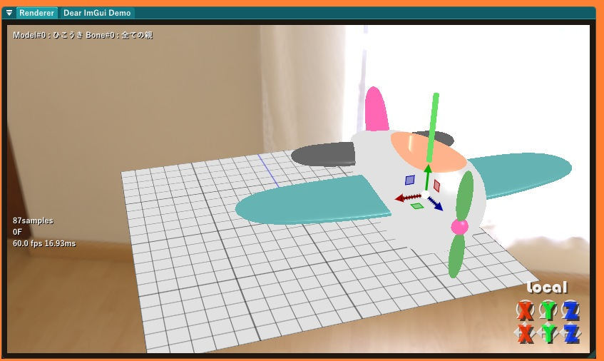

`register`を押したという事はキーフレームに記録されています。

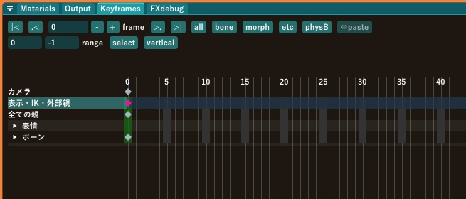

このように、`座標軸`モデルのキーフレームに「表示・IK・外部親」キーとして登録されています。

## キーのコピペとアンドゥ・リドゥとか

ここで、最初のフレームからではなく30FからY軸が飛行機に載って動くような設定にしたいと思ったとしましょう。そういう時は、0Fに登録されている表示・IK・外親を選択し(既に選択状態になっていますけど、外れている場合は左クリックで選択状態に出来ます)、`Ctrl+X`キーを押してキーをカットします。0Fにはデフォルトのキーが自動的に登録されるので、菱形のマーク自体は消えません。

次に、30Fに移動して、`Ctrl+V`を押すと、カットしたキーは30Fにペーストされます。

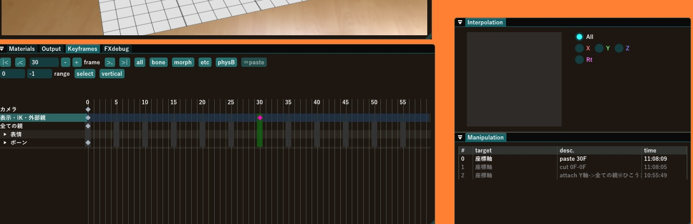

お察しの通り、`Ctrl+C`なら元のキーは消さずにコピーだけ行うことが出来ます。

キーフレームの操作についての履歴は中央下やや右の`Manipulation`ウィンドウに記載されます。最近の操作ほどリストの上の方に載り、白くハイライトされている操作内容は`Ctrl+Z`を押すと取り消せます(アンドゥ)。間違って`Ctrl+Z`を押してしまったときは`Ctrl+Y`を押すと「取り消したのを取り消し」(リドゥ)できます

Historyにした方が良いんじゃねぇかと突っ込まれましたが、どうなんでしょう。操作についての履歴なのでどっちでもいいじゃねぇかとそのままにしておりますけど。

それから、`Keyframes`ウィンドウで左ドラッグするとキーを範囲選択できます。もうわかってるかな？

## 補間曲線

次は`ひこうき`の方を動かしてみましょう。`Models`で`ひこうき`を選択し、0Fで奥の方、60Fで手前上の方に動くよう、キーを打ちます。

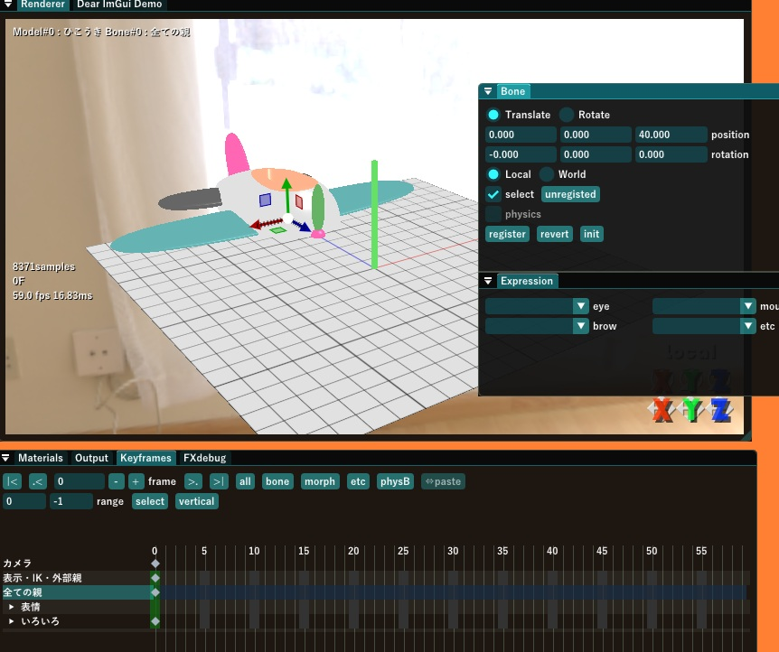
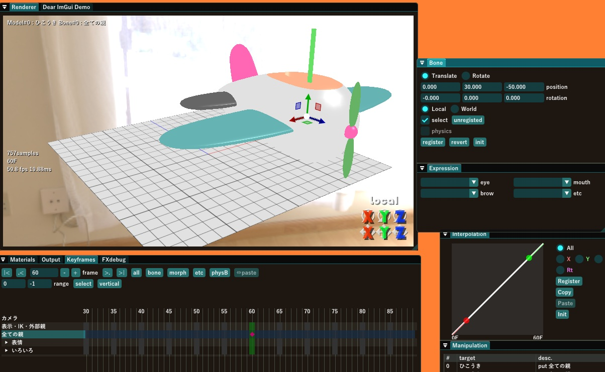

カメラもてきとうにキーを打ってから、アニメーションを再生すると30Fの時点でY軸の緑の棒が`ひこうき`にパイルダーオンしている様子が見れらます。カッコいい！？

ここで、`ひこうき`の動きをはじめはゆっくり、だんだん加速して動く、という具合に変化させたいと思います。その場合は、`Manipulation`ウィンドウの上にある`Interpolation`ウィンドウで補間曲線の設定が出来ます。

まず、`ひこうき`の60Fの`全ての親`ボーンについてのキーを選択して、補間曲線を設定するキーを指定します。(複数のキーを選択した場合、選択されている全てのキーの補間曲線を一度に設定できます)

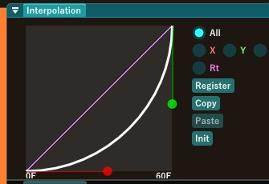

このように最初はゆっくり起き上がって後半は急速に増えるような曲線を描いて`register`ボタンを押すと、まさに**はじめはゆっくり、だんだん加速**する動きになります。

補間曲線エディタの使い方ですが、

1. 赤い丸と緑の丸をドラッグして曲線の形を操作できます
2. 曲線の下の方に何Fから何Fにかけての動きなのかが表示されます
3. 右上の`All`(全て) 以外の`X` `Y` `Z`(X-Z軸平行移動) `Rt`(回転) というラジオボタンでキーの各要素についての補間曲線を個別に設定できます。今は`All`として全要素に同じ補間曲線が割り当てられる設定にしています
4. `Register`で選択されたキーの補間曲線を編集中の曲線で置き換えます(本家MMDと違っていじったら即反映されるわけではない点に注意してください)
5. `Copy` `Paste` ボタンで補間曲線のコピペができます
6. `Init`ボタンで初期状態の補間曲線(直線)に戻します

補間曲線は後ろの方のキーに記録されている情報が使われるという点に注意が必要です。`Interpolation`ウィンドウの下に書いてあるフレーム番号を見ればそのことが分かります。

## カメラのリアルタイム記録

せっかくなのでMikuMikuDayo固有の機能としてカメラをマウスの操作(とスペースキー連打)だけで作れる事も覚えておきましょう。

かんたんなアニメーションだったらカメラのキーは1つ2つで完結しますが、もうちょっと長くなってくるとカメラのキーも数百に及ぶ事があるでしょう。そんなときはアニメーションを再生しながらマウスでカメラを動かして記録することが出来ます。

まず、`Animation`ウィンドウの`range`にカメラの記録範囲を指定します。今回は0F～60Fで2秒しかないので`speed`に0.3を指定し、0.3倍速でゆっくり観察しながら記録をすることにします。

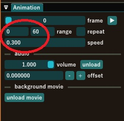

これでカメラを記録する範囲と記録時のスピードの調整ができました。

次に、`Models`ウィンドウで`Camera/Light`を選択して`record...`ボタンを押します

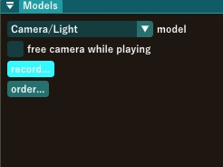

`OK`をクリックすると記録を開始します。

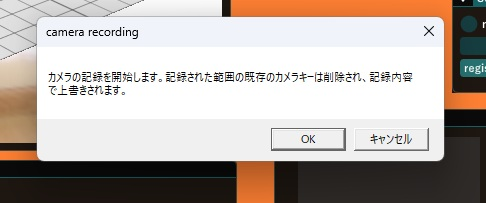

マウスを動かしてカメラを操作し、スペースキーを押すと、その位置・姿勢・時刻でのカメラの状態がキーフレームに記録されます。

わりとスペースキー連打状態になるかもしれません。がんばって！

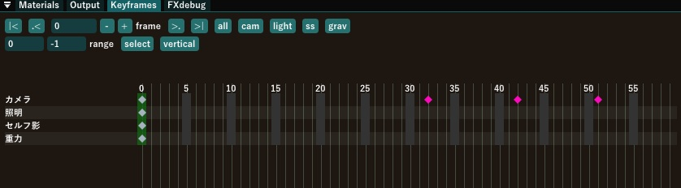

記録が終わるとこのように、記録範囲に元々あったカメラのキーは今記録したカメラのキーで置き換えられ、記録されたキーが選択された状態になっているので、再生して気に入った結果になっているなら補間曲線を設定するもよし、そうでもないならアンドゥして取り消すもよし。

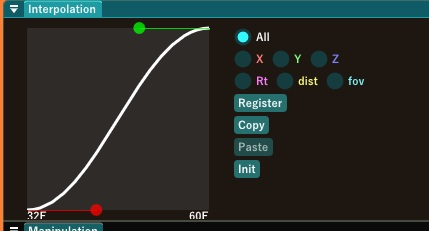

補間曲線はとりあえずこういうS字カーブにしておくとカクカクしないで無難な感じに動いてくれます。わりとおすすめです。

## まとめ

以上で第三章を終わります。この章では
- 外部親
- キーの選択とコピペ、アンドゥ・リドゥ
- 補間曲線
- カメラのリアルタイム記録

について説明しました。