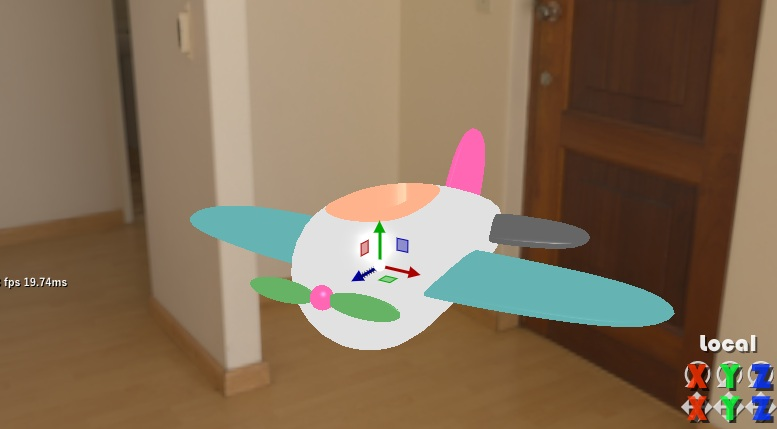
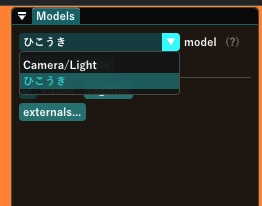
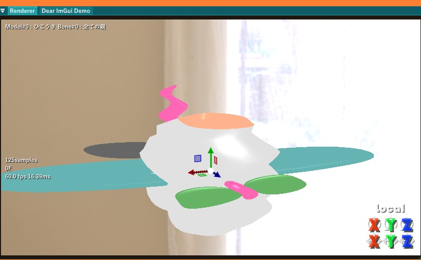
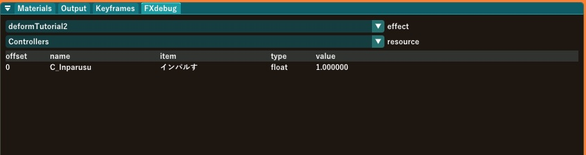

# 第二章 デフォーマの作り方

デフォーマとは、頂点数とトポロジを変化させない範囲で物体を変形させるエフェクトのことです。

デフォルトのデフォーマは各モデルの

- デフォルトの状態(基本的にAスタンス)の頂点バッファ
- ボーンに関連付けられた行列
- 表情モーフ・UVモーフの値
- 各頂点がどの行列からどれだけ影響を受けるか
- 各頂点がどの表情モーフ・UVモーフの影響をどれだけ受けるか

これらを入力として

- モデルの各頂点の位置・法線・接線・UV座標を表示できる状態に変形させた頂点バッファ

を出力とするエフェクトです。この変換の事をスキニングといいます。表示する必要のあるモデル1つにつき1つのエフェクトが生成され、アニメーションの再生やフレームの移動・更新など、スキニングが必要になる都度起動されます。

なんだかものすごく難しそうですが、実際にデフォルトのデフォーマと全く同じ動作をする**特に意味はないがきわめて重要なデフォーマ**を作るのは簡単です。

## とりあえず手を動かそう

まずはいつも通り、MikuMikuDayoを起動しましょう。そうしたら、今回の教材である、`sample/deformSample.pmx`をドロップして読み込みます



ひこうきじゃねーか！

その通りです。でもちょっと待ってください、`Models`ウィンドウでモデル一覧を見ると



なんか、ひこうきの字が水色になっています。

`sample/deformSample.fxdayo`というモデルのファイル名と同名の`.fxdayo`ファイルがあるのでエフェクト付きモデルであるとして自動的に読み込まれてエフェクトが起動しています。水色になっている場合はデフォルトではないデフォーマが付いている事を示しています。

## fxdayoの構造

`sample/deformSample.fxdayo`の中身は以下のようになっています。テキストエディタやVScodeで覗いてみましょう。

```c
#include <yrz.hlsli>
#include <resources_deform.hlsli>
#include <skinning.hlsli>

[YRZFX]
{
    "fx": {
        "cereal_class_version": 0,
		"category" : "deform",
        "passes": [ { "name":"Main", "type":"compute", "computeShader":"CS" } ]
    }
}
[HLSL]

#ifdef YRZ_PASS_Main
YRZ_NUMTHREADS
void CS( uint3 id : SV_DispatchThreadID )
{
    Dayo::OutBuf[id.x] = Dayo::DefaultSkinning(id.x);
}
#endif
```
かんたんでしょう！？これだけ短かったらサクッと読めそうじゃないですか？

fxdayoファイルの構造は以下の通りで
```
HLSL部前半
[YRZFX]
json部(エフェクト・リソースの定義)
[HLSL]
HLSL部後半
```
という非常に原始的な構造になっています。今回のサンプルではHLSL部前半には何かinclude文が書いてあります。

大事な注意点ですが、\[YRZFX\]および\[HLSL\]という区切りシンボルは必ず行頭に書き、その行には他に何も書かないようにしてください。

## HLSL部前半のinclude文

最初に`yrz.hlsli` `resources_deform.hlsli` `skinning.hlsli`という3つのファイルをインクルードしています。この3つのファイルはそれぞれ大事なモジュールになってまして

- **yrz.hlsli**  
よろずDXRに付属の便利なルーチン群を集めた物です。とりあえず入れときましょう。名前空間はYRZです。

- **resources_deform.hlsli**  
デフォーマから参照できるリソースの定義をまとめた物です。デフォーマを作る場合は必ずインクルードしてください。読めば入出力に用いるリソースがなんであるかの一覧として使えます。名前空間はDayoです。

- **skinning.hlsli**  
デフォルトのスキニングを実行するためのコードを定義しています。デフォーマを作る場合はとりあえずインクルードしとくといいでしょう。Dayo::DefaultSkinningという関数がこのモジュールで定義されている関数です。これも名前空間はDayoです。

これらのモジュール内ではMikuMikuDayo固有の型などが定義されていて、json部から参照される事もしばしばあります。とりあえずinclude文はHLSL部前半に置くのがオススメです。

## json部でエフェクトの定義
次に、json部を見ていきましょう。
```json
{
    "fx": {
        "cereal_class_version": 0,
		"category" : "deform",
        "passes": [ { "name":"Main", "type":"compute", "computeShader":"CS" } ]
    }
}
```
jsonで`fx`という1個のオブジェクトを定義しているだけです。`fx`オブジェクトの定義がすなわちエフェクトの定義である、という事です。jsonが全く分からない人も、以下を順に読めばなんとなく分かると思います。

`fx`オブジェクトのパラメータは実に色々あるのですが、今回のチュートリアルでは3つだけ定義してあります。

```json
"cereal_class_version": 0,
"category" : "deform",
"passes": [ { "name":"Main", "type":"compute", "computeShader":"CS" } ]
```

- **cereal_class_version**  
これは使用しているjsonパーサであるCerealがファイルバージョンを認識するための物です。そのままコピペしてください
- **category**  
このエフェクトがどのカテゴリのエフェクトなのかを指定します。文字列で"deform"と書くとデフォーマであるという事がMikuMikuDayoから認識できるようになります
- **passes**  
パス群の定義です。複数のパスから成る場合もありますから、配列オブジェクトになっています。

さらに降りてpasses配列を構成するオブジェクトのパラメータについて説明します

```json
"passes": [ { "name":"Main", "type":"compute", "computeShader":"CS" } ]
```

- **name**  
パスの名前です。HLSL部分の作成の時に使います。
- **type**  
パスの種類です。今回はcompute shaderを使いたいので"compute"を指定します
- **computeShader**  
compute shaderのエントリポイント名です。HLSL部分の作成の所で説明します。

エントリポイントというのは名前通り**入口**のことですが、この3つのパラメータにより、**Main**という名前のパスが**CS**というcompute shaderで書かれた関数を呼び出すのだと決定されました。compute shaderを使うcomputeパスの定義は割合シンプルですが、他のタイプのパスの定義はもっとパラメータが多くなることがあります。追々説明します。

パスについての説明が良く頭に入っている人は「入力リソースと出力リソースについて何も書かれていない」事に気づくかもしれません。今回はMikuMikuDayoが内部的に管理しているリソースが入出力の対象になるのでパスの定義に書く必要が無いのです。

今後エフェクト内でリソースの定義をするエフェクトを書く時にまた説明しますが、パスへの入力リソースは基本的に書く必要がありません。出力リソース以外は入力リソースとして扱うことが出来ます。

## HLSL後半でシェーダのコード
次に、HLSL部に書かれたシェーダのコードを見ていきましょう

```c
#ifdef YRZ_PASS_Main
YRZ_NUMTHREADS
void CS( uint3 id : SV_DispatchThreadID )
{
    Dayo::OutBuf[id.x] = Dayo::DefaultSkinning(id.x);
}
#endif
```

さっきjson部でpassesに、**Main**という名前のパスが有って、エントリポイントになる関数は**CS**であると定義しました。

ちょっとクセのあるところですけど、**YRZ_PASS_パス名**というシンボルが有効になった時だけコンパイルされるように、ifdef文で1つのパスにだけ関係するコードブロックを隔離します。とりあえず今は**まあ、そういうもんだ**と思って真似してください。

それから、**YRZ_NUMTHREADS**というマクロが置いてあります。これはcompute shaderをいじったことのある人ならわかる、スレッド数の指定、\[numthreads(x,y,z)\]に展開されますのでcomputeパスのエントリポイントには付記するようにしてください。x,y,zの値はjson部から生成される値が自動的に入ります。今回は何も書いてないのでデフォルトのスレッド数で起動されます。

それ以外は普通のcompute shaderとあまり変わらず、**CS**というエントリポイントになる関数で、OutBuf\[id.x\]に対してDayo::DefaultSkinningの結果を代入しているだけです。

DefaultSkinningの内容はそのうち一度は目を通してもらえるといいかなと思いますけど`hlsl/skinning.hlsli`に収録されています。

`hlsl/resources_deform.hlsli`から辿ると分かるように、OutBufはスキニングの結果変形した頂点を格納するRWStructuredBufferで、id.xが頂点番号に当たると察せられると思います。

以上で、サンプルコードの解説は終わりです！

一応、パスごとにコードブロックを隔離する理由が気になるのですぐ解決したい人向けの話ですが、複数のパスを持ったエフェクトを作ると、同じリソースを参照するにしてもパスごとに入力リソースだったり出力リソースだったりしますから、違う型のオブジェクトを使って参照される事になるのでリソース1はパスAからは「読み書き可能オブジェクト」パスBからは「読み込みだけ可能オブジェクト」として定義されねばならない事も有ります。そういう場合にはパスAとパスBのコードは一緒にコンパイルできなくなりますが、パスAとパスBで同じ関数を使いまわしたい場合は共通のコードブロックとして書いておけるようにすると便利ですから、結局1つのソースコードとして全パスのためのコードをまとめて、各パスのシェーダを生成するために条件付きコンパイルをする事でエフェクトの各パスから起動されるシェーダ群を生成することにしています。そのためこのようにキモい事と相成り候。


## 知っておくとよいこと

このjsonとHLSLで書かれた`fxdayo`ファイルは、よろずFX側で全部HLSLに変換されて、よろずDXRでHLSLコンパイラに放り込まれて中間言語(DXIL)ファイルに変換されます。DXILファイルがシェーダとしてグラフィックドライバに読み込まれて実行可能なファイルです。

この、よろずFXで一旦HLSLに変換された物はHLSLのソースコードとして出力されるので普通にVSCodeなどで読むことが出来ます。場所は`shadercache/コンパイル元のエフェクトファイル名.source.hlsl/`です。

今回のチュートリアルで扱った`deformTutorial.fxdayo`の変換後のHLSLファイルを覗いてみましょう。`shadercache/deformTutorial.fxdayo.source.hlsl`というファイルに出力されています。

```c
#include <yrz.hlsli>
#include <resources_deform.hlsli>
#include <skinning.hlsli>

#ifdef YRZ_PASS_Main
#endif

#ifdef YRZ_PASS_Main
YRZ_NUMTHREADS
void CS( uint3 id : SV_DispatchThreadID )
{
    Dayo::OutBuf[id.x] = Dayo::DefaultSkinning(id.x);
}
#endif
```

なんと、ほとんど何も変わりません、よろずFX仕事しろ！

と言いたいところですが、今回のエフェクトでは特にエフェクトの中だけで使うようなリソースを定義していないからです。もうちょっと複雑なエフェクトを作るとみるみる様子が変わっていきます。ご期待ください。

あまりこれを覗く事は無いかもしれませんが、よろずFXはHLSLプロセッサとして作られているという事だけ頭の隅っこにでも置いといて頂けると理解が深まるかなと思います。

## デフォーマをいじってみる

最もかんたんなサンプルを眺めて終わり、というのはちょっと端折りすぎですから、いじり方の例も1つやってみましょう

物体の変形をさせるのがデフォーマの仕事ですから、このように酔っぱらったひこうきを作ります。



```c
#ifdef YRZ_PASS_Main
YRZ_NUMTHREADS
void CS( uint3 id : SV_DispatchThreadID )
{
    Dayo::Vertex v = Dayo::DefaultSkinning(id.x);
    v.position.x += sin(v.position.y)*2;
    Dayo::OutBuf[id.x] = v;
}
#endif
```
コードを↑のように、ちょっと書き換えました。
`Dayo::Vertex`型の変数`v`に一旦スキニングの結果を保存して、それを元に位置をさらに動かすわけです。`Dayo::Vertex`型は`hlsli/dayotypes.hlsli`に定義されています。

読み込まれているエフェクトのコードを書き換えて保存すると、MikuMikuDayoは自動的に再コンパイルしてエフェクトを読み込み直しますが、スキニングの必要が無い場合はデフォーマは起動されないので、動作モードを**ガンガンいこうぜ**以外にしている場合は編集対象フレームを前後に動かしたりボーンをうごかしたりして手動でスキニングが走るようにする必要があります。ですからデフォーマの作成中は**ガンガンいこうぜ**にしとくと捗るでしょう。

さて、これでは動きが無いので寂しいですから動きをつけてみます。
```c
#ifdef YRZ_PASS_Main
YRZ_NUMTHREADS
void CS( uint3 id : SV_DispatchThreadID )
{
    Dayo::Vertex v = Dayo::DefaultSkinning(id.x);
    v.position.x += sin(v.position.y + Time)*2;
    Dayo::OutBuf[id.x] = v;
}
#endif
```
`Time`をsinの中につけただけですが、これでウネウネとキモいアニメーションをするようになります。

なんでか`Dayo::Time`と名前空間Dayoを付けても付けなくても参照できるのですが、constant bufferに書かれている変数は名前空間を貫通するのがHLSLの仕様なんだそうです。Timeは定義済みのconstant bufferに書かれている値なのでDayoは付けても付けなくてもOKです。

というわけで、定義済みのconstant bufferという物が`hlsl/cb.hlsli`に書かれており、これは`resources_deform.hlsli`から間接的に読み込まれています。その中を読むと定義済みのconstantbuffer内の変数と意味について知ることが出来ます。

これだけでは法線も接線も変化しませんから、Subayaiなどのまともなレンダラに載せると奇妙な見た目になることもありますが、チュートリアルの本筋からは外れるのでそこまではやりません。

## コントローラから値を得る

モデルのモーフやボーンの位置をエフェクトから得たい、という事は多々あるでしょう。このサンプルのひこうきには**インパルす**モーフがありますから、この値を得てウネウネ度合いを制御してみようと思います。

こういうエフェクトの制御用の変数の供給元になるモデルの事を**コントローラ**と呼びます。デフォーマの場合はデフォーマを起動元のモデル自体がコントローラの役割を兼用する事が多いです。

それにはjson部をいじります

```json
[YRZFX]
{
    "fx": {
        "cereal_class_version": 0,
		"category" : "deform",
        "controllers" : [
			{ "name":"C_Inparusu", "controllerName":"(self)", "item":"インパルす", "type":"float" },
        ],
        "passes": [ { "name":"Main", "type":"compute", "computeShader":"CS" } ]
    }
}
[HLSL]
```

`controllers`というパラメータが`fx`の中に増えました。配列オブジェクトになっており、中は

- **name** HLSLの中で指定された変数名で値を受け取ることが出来るようになります
- **constrollerName** コントローラになるモデルのファイル名です。`(self)`は予約語で、指定するとエフェクト起動元のモデルを指します。他のモデルを指定したい時はパス名を除くファイル名として`foobar.pmx`のように指定します。
- **item** コントローラになるモデルの持っているモーフ名またはボーン名を指定します。一致するモーフ値またはボーンの座標が**name**で指定した変数に代入されます
- **type** コントローラの値を受け取る変数の型を示します。変数の型によってモーフから値を受け取るのか、ボーンの座標(3Dベクトル)・姿勢(行列)から受け取るのかといった事を識別します。

今回は**type**に`float`を指定したので、`インパルす`モーフの値を`C_Inparusu`という変数に受け取るという事になっています。

詳しくはリファレンスを[どうぞ](../docs/html/struct_y_r_z_1_1_f_x_controller.html)

コードの方は以下のようにいじります

```c
#ifdef YRZ_PASS_Main
YRZ_NUMTHREADS
void CS( uint3 id : SV_DispatchThreadID )
{
    Dayo::Vertex v = Dayo::DefaultSkinning(id.x);
    v.position.x += sin(v.position.y + Dayo::Time)*2*C_Inparusu;
    Dayo::OutBuf[id.x] = v;
}
#endif
```

`C_Inparusu`に`インパルす`モーフの値が代入されているので、`インパルす`モーフが0の時はウネウネしなくなりました。

## 便利なFXdebug

エフェクトにはデバッガでブレークポイント張ったりするのが難しい…というかできるのかどうか僕も良く知らないので、エフェクトのデバッグの一助になるようなモノがMikuMikuDayoにあります。`FXdebug`ウィンドウという物で↓のようなウィンドウです



エフェクト内で定義されているコントローラやリソースの状態をリアルタイムで表示してくれる優れ者です。`effect`コンボボックスで見たいエフェクトを選び、`resource`コンボボックスで見たいリソースを選択します。今回はコントローラの変数が1つだけ定義されていますから、ちゃんと`インパルす`モーフからC_Inparusu変数に値が入っているかどうかのチェックができます。ご活用ください。

これはMikuMikuEffectを書いてた頃にほんとうに欲しくて欲しくて仕方のないものだったので、無事にこしらえることができてよかったです。

## 一般的な注意
ソース内ではコントローラのモーフの値を受け取るように指定してるのにちゃんと受け取れない、FXdebugでも値が出てこない、という場合はソースコードのエンコードがUTF-8以外になっている可能性や、jsonのパラメータ名を間違っている可能性があります。

jsonパーサの仕組み上、よろずFXで受け付けられないパラメータ名が混入していた場合でも基本的によろずFXは無視するだけで通常通り処理を進めてしまいます。例えば"passes"を"pass"とか"Passes"と書き間違えるとパスが0個のエフェクトとして普通に処理されて何も仕事をしないエフェクトが爆誕します。この点は作者である僕自身も足をすくわれる所なのでお気を付けください。


## まとめ

第二章では、最も簡単なデフォーマの例とちょっとしたいじり方を見ました

エフェクトの基本は以下の通りでした
- モデルのファイル名と同名の`fxdayo`ファイルが存在するとエフェクトとして読み込まれる
- `fxdayo`ファイルはjson部とHLSL部に分かれる
- json部で`fx`オブジェクトを定義することでエフェクトを定義する
- HLSL部にシェーダのコードを書く

コード作成とデバッグの基本としては
- passes配列オフジェクトで定義される各パスのHLSLコードは`#ifdef YRZ_PASS_パス名 ～ #endif`で囲う
- `hlsl/cb.hlsli`にシェーダから利用できる定義済みのグローバル変数について書いてある
- controllers配列オブジェクトによってコントローラからHLSL内に値を受け取る変数を作れる
- FXdebugウィンドウでリソースの状態を見ることが出来る

ここまでで扱った情報だけではまだまだ自由自在にデフォーマを作成するという訳にもいかないでしょうが、ポストプロセスやレンダラの作り方なども一度読んでみて、どんな情報をどんなオブジェクトから得て、どんなことが出来るのかという事を知ると作れるものの幅が随分広がると思います。

エフェクト作成の知識を手っ取り早く得るには同梱のエフェクトのソースを読むのが近道ですから、**それを読めるようになる**ところまでがチュートリアルの役目という程度に捉えて頂けるといいんじゃないかと。

## 余談
ところで、動作モードをガンガンいこうぜにして`インパルす`モーフを上げてもプロペラ回らなかったりしません？

ひこうきを地面から上げて下さい。プロペラの剛体が地面とぶつかってると回りません。
