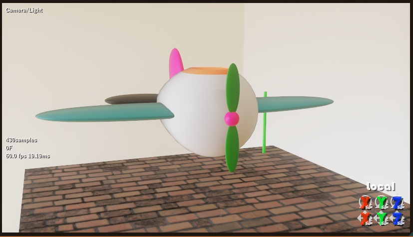
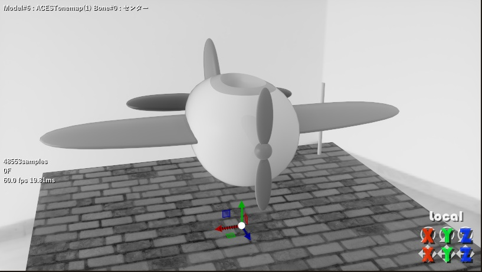
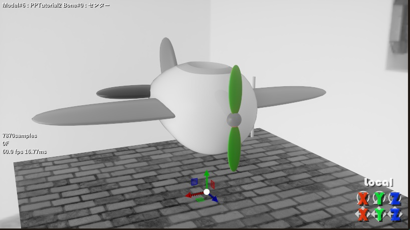
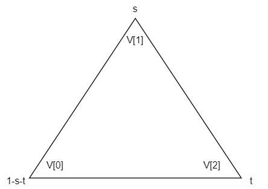
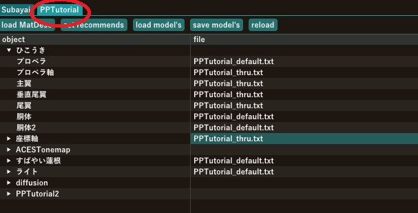
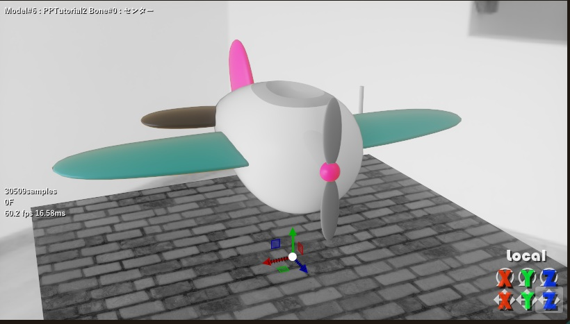
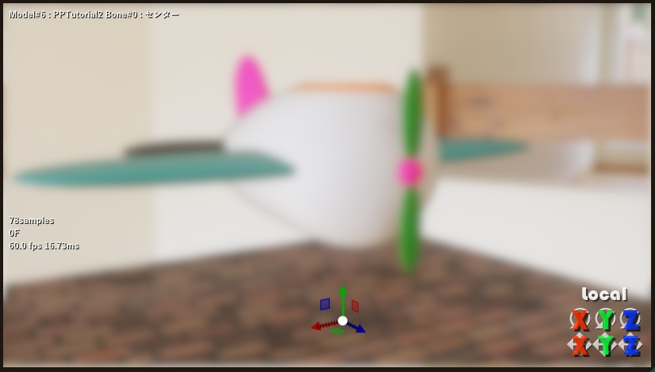
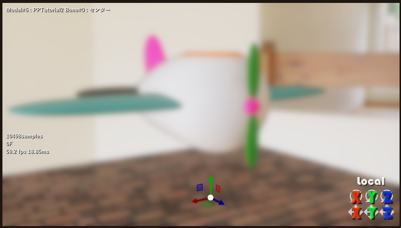

# 第三章 ポストプロセスの作り方

ポストプロセスはレンダラが出力した画像に対して色調補正など後処理をするためのエフェクトの事です。

割合にかんたんに作ることが出来て効果も多彩なのでエフェクト作りの二歩目としては良いんじゃないでしょうか。

## 準備とおことわり

まず、てきとうにMikuMikuDayoで処理前の絵を作りましょう。

口絵はいつもながらひこうきと座標軸の絵なんですけど、皆さんのお好きに作って、てきとうなファイル名でdayoファイルを保存しといてください。



エフェクトの書き方がまずいとMikuMikuDayoごと落ちる事はわりとあるので、エフェクトのコードをいじろうと思ったときは作業中のdayoファイルは必ず保存してから手を付ける習慣をつけておきましょう。このチュートリアルを書いている途中にも1回落ちてひこうきを置き直しました。

MikuMikuDayoの作り的にそういうのはマズいというのは分かるんですけど特にDirectX12のエラー検知機構は融通が利かない面があって変な入力を渡すと異常な動作をするよりはマシとドライバごとシャットダウンしやがったりします。それはそれで有難いのですがモンハンワイルドではビデオカードぶっ壊したりしてたよなあ…あれカプコン被害者でしょ完全に。という脱線はさておき、なるべく、よろずFX側で検知できる異常な入力は弾いてはいるのですが、ぼくが気づいてカバーできる範囲にも限界があるのでそういう事になってます。すんません。

## 今回のサンプル

`sample/postprocessTutorial.pmx`と`sample/postprocessTutorial.fxdayo`が今回のサンプルになります。pmxの方をMikuMikuDayoにドロップするとサンプルのポストプロセスが読み込まれ、画面が白黒になります。単純なモノトーンにするポストプロセスです。



コードの解説に入りましょう。

```c
#include <resources_pp.hlsli>
#include <yrz.hlsli>

[YRZFX]
{
    "fx": {
        "cereal_class_version": 0,
		"category" : "postprocess",
        "controllers": [{"name": "C_off","controllerName": "(self)","item": "off","type": "float"}],
		"samplers": [{ "name":"samp"}],
        "passes": [ {"name":"Main", "type":"postprocess", "vertexShader":"VS", "pixelShader":"PS"} ]
    }
}
[HLSL]

#ifdef YRZ_MASS_Main
struct VSO {
	float4 pos:SV_POSITION;
	float2 uv:TEXCOORD;
};

VSO VS( float4 pos : POSITION, float2 uv:TEXCOORD )
{
	vso.pos = pos;
	vso.uv = uv;
	return vso;
}

float4 PS(VSO vso) : SV_TARGET
{
	float4 I = Dayo::ScreenTexture.Sample(samp, vso.uv);
	float4 O = I;
	O.rgb = YRZ::RGBtoY(I.rgb);
	O.rgb = lerp(O.rgb,I.rgb, C_off);
	return O;
}
#endif
```

デフォーマのサンプルと比べると長くなってますが、今回は最初からコントローラからの入力に対応していて、`C_off`という変数に`off`モーフの値を得てモノトーンにしたり戻したり出来ます。

上から順にみていきましょう、最初のインクルード文は

```
#include <resources_pp.hlsli>
#include <yrz.hlsli>
```

ポストプロセスでは`resources_pp.hlsli`をインクルードする事になっています。ポストプロセスからのみ参照されるリソースという物が有って、このサンプルからもアクセスしています。

次にjson部を見ていきましょう
```json
{
    "fx": {
        "cereal_class_version": 0,
		"category" : "postprocess",
        "controllers": [{"name": "C_off","controllerName": "(self)","item": "off","type": "float"}],
		"samplers": [{ "name":"samp"}],
        "passes": [ {"name":"Main", "type":"postprocess", "vertexShader":"VS", "pixelShader":"PS"} ]
    }
}
```
`fx`オブジェクトの中身がぼちぼち変わりましたね。

- **category**<br>
`postprocess`を指定し、このエフェクトがポストプロセスである事を示します。
- **samplers**<br>
配列オブジェクトでテクスチャの中身を読み取るための**サンプラー**というオブジェクト群を作ります。今回のサンプルでは`samp`という名前で、全部デフォルトのパラメータがセットされたサンプラーを作ります。
- **passes**<br>
今回も`Main`だけの1パスのエフェクトですが、`type`パラメータに`postprocess`が指定されており、シェーダにはvertex shaderとpixel shaderの2つを使います。それぞれのエントリポイント名が`VS`, `PS`です。

HLSL部にコードは以下のように、vertex shaderとpixel shaderの2つを定義します

```c
#ifdef YRZ_MASS_Main
struct VSO {
	float4 pos:SV_POSITION;
	float2 uv:TEXCOORD;
};

VSO VS( float4 pos : POSITION, float2 uv:TEXCOORD )
{
	vso.pos = pos;
	vso.uv = uv;
	return vso;
}

float4 PS(VSO vso) : SV_TARGET
{
	float4 I = Dayo::ScreenTexture.Sample(samp, vso.uv);
	float4 O = I;
	O.rgb = YRZ::RGBtoY(I.rgb);
	O.rgb = lerp(O.rgb,I.rgb, C_off);
	return O;
}
#endif
```

ちょっと紛らわしくて申し訳ないのですが、エフェクトのカテゴリとしてのポストプロセスと、パスの種類としてのpostprocessがあって、概念としては独立しています。

ポストプロセスのvertex shaderは単純で、`POSITION`, `TEXCOORD`というセマンティクス付きで入力された変数`pos`,`uv`を`VSO`構造体に代入して、pixel shaderに投げているだけです。

セマンティクスっていうのは変数名の後に : と何かついているヤツのことで、**その変数は何に使われるつもりなのか**という意図(semantics)を示すための物です。シェーダ記述言語にはよくでてきて、エントリポイントになる関数への入出力に使われます。

例えばvertex shaderのエントリポイント`VS()`が以下のようだったらどうなるでしょうか

```c
VSO VS( float4 pos, float2 uv )
```
これではposとuvに何を入力したらいいのかドライバ側から分かりません。一方で以下のようにちゃんと書いたとしましょう

```c
VSO VS( float4 pos:POSITION, float2 uv:TEXCOORD )
```

こうする事で、`pos`には`POSITION`というセマンティック名に合った値として頂点の位置データを、`uv`には`TEXCOORD`というセマンティック名に合った値として頂点に割り当てられたテクスチャ座標をそれぞれ渡してやればいいんだなあ、として判然とするのです。

同様にpixel shaderのエントリポイント`PS()'についても

```c
float4 PS(VSO vso) : SV_TARGET
```

これは関数の返り値に`SV_TARGET`セマンティクスが付いてます。この場合、**この関数の返り値はfloat4型だけど`SV_TARGET`に代入して終わる事にしてね**という断り書きになるわけです。

`SV_TARGET`というのはレンダーターゲット(シェーダの出力先)に書き込まれる事を表すシステム変数です。他にどんなセマンティクスがあるのかという事は一度[こちら](https://learn.microsoft.com/ja-jp/windows/win32/direct3dhlsl/dx-graphics-hlsl-semantics)を見ておくとプログラミングの幅が広がりますよ。

さて、今回はパスの種類`type`として`postprocess`が指定されているので、postprocessパスとしてパスが作られました。postprocessパスは画面の4つの隅の点を作る4つの頂点がよろずDXRから渡されてvertex shaderで処理されます。vertex shaderは頂点の数だけ起動されるので、1フレームにつき4回、この`VS()`は呼び出されるという事になります。

4つの頂点は正規化デバイス座標系と呼ばれる左下隅が画面の(-1,-1),右上隅が(1,1)になるような座標系になっていてそれをセマンティクス付きの出力変数(VSO構造体の中に入っている`pos:SV_POSITION`と`uv:TEXCOORD`です)に返すと、「今処理した頂点は画面上のどこの点に対応するのか」という情報がドライバ側に伝達されます。

ドライバはVertex shaderから処理済みの頂点を受け取ると、「画面上のどの範囲がこのポリゴンで塗りつぶされるのか」という事を決定し、塗りつぶされる範囲の1ピクセル毎にpixel shaderを呼んで画面を作成します。ですから、PS()は画面の画素数と同じ回数だけ呼ばれて実行されます。すごいですね！

それを踏まえて`PS(VSO vso)`を読むと、引数`vso`は`VS()`の返り値そのままではなく、GPUドライバ側で塗りつぶしたいポリゴン上の位置ごとにうまいこと補間してくれた値が入っている事が察せられると思います。察して。

つまり、`VS()`から`PS()`が直接呼ばれている訳ではなく、`VS()`の返り値を元にドライバ側で処理が走って`PS()`が何百万回も呼ばれる、という先に述べた説明通りになっている訳です。

さて、pixel shaderの部分をもうちょっと説明しましょう

```c
float4 PS(VSO vso) : SV_TARGET
{
	float4 I = Dayo::ScreenTexture.Sample(samp, vso.uv);
	float4 O = I;
	O.rgb = YRZ::RGBtoY(I.rgb);
	O.rgb = lerp(O.rgb,I.rgb, C_off);
	return O;
}
```
こうなっているわけですが、`Dayo::ScreenTexture`というオブジェクトで既に描かれている画面の内容を読み取ることが出来ます。読み取るためのメソッドが`Sample`で補間とかはどんなふうにして読み取るのか、という事を指定するサンプラーというオブジェクトにさっき作った`samp`を指定し、どこから読み取るのかという場所を`vso.uv`としてしています。

読み取った結果はRGBAの4チャンネルありますから、Aチャンネルはそのまま保持します。RGBチャンネルについては`YRZ::RGBtoY`という関数でRGB値から明度を計算して1次元の値にします。1次元の値をO.rgbという3次元の変数に代入するとO.rgbそれぞれに同じ値が入るのでO.rgbはそれぞれ同じ値になるため灰色になる、という仕組みです。

こうしてRGBだけモノクロ化してαチャネルだけは元と同じになっている画素の値を出力してドライバ側に伝え、ドライバ側で後は具体的に画面を塗りつぶす作業を進めていきます。

# ちょっと動作を細かくする

この状態では画面全体がモノクロ化されますけど、画面の一部だけ、狙った物体だけモノクロ化解除とか、その逆とかできないでしょうか？と思ったとします。

そのためにはpixel shaderから**今アクセスしている画素はどの物体の一部なのか**という情報にアクセスできないといけないわけですが、ちゃんとそのための仕組みはあります



以下のようにコードを変更しました。

```c
float4 PS(VSO vso) : SV_TARGET
{
	float4 I = Dayo::ScreenTexture.Sample(samp, vso.uv);
	float4 O = I;
	O.rgb = YRZ::RGBtoY(I.rgb);

	uint2 pix = vso.pos.xy;
	uint2 GB = Dayo::GBuffer1[pix];
	uint imo = GB.r;
	uint iface = GB.g;
    float thru = 0;

    if (imo != Dayo::Inai) {
        int imat = Dayo::Faces[imo][iface];
        thru = (imo==0 && imat==0);
    }

	O.rgb = lerp(O.rgb,I.rgb, max(C_off,thru));
	return O;
}
```

何をどう書き換えたのかというと、`GB`という変数に`Dayo::GBuffer1`から画面に**書いてある内容はモデルのどこ由来なのか**という情報を得ます。

`hlsli/resources.hlsli`を見ると分かりますが、GBuffer1はRWTexture2Dオブジェクトになっており、`Sample`メソッドでの読み込みではなく配列変数のように読み書きします。配列の添え字はuint2型で画面上の位置をピクセル数単位で指定します。

何気にvso.pos.xyには画面上の画素の位置がピクセル単位で入っているのでこういう時に重宝します。float2型からuint2型に型変換を行うので端数は切り捨てられます。それでいいのです。

実は今回扱う程度の範囲であればScreenTextureからの読み込みもScreenTexture[pix]で済むのでサンプラー要らないのですが、作り方は知っといた方がええですからね。

GBの内容はどうなっているのかというと

- **r** モデル番号
- **g** 面番号

という事になっています。

モデル番号は現在MikuMikuDayoに読み込まれているモデルのリストに対して上から0、1…と割り振られ、一番下のモデルが一番きな番号になります。面番号も0から始まります。

GBufferには何気に2もあります。`GBuffer2`の方からは、float2型で重心座標が得られ、GBuffer1の情報と合わせて**どのモデルのどの面のどこなのか**が特定できます。

今回は面番号まで分かれば十分なので重心座標は使っていませんが、重心座標とは三角形の中の位置を表す座標です。頂点のワールド座標V[0],V[1],V[2]が与えられ、重心座標(s,t)が与えられた場合、以下のように三角形上の一点のワールド座標Wを求められます。

```
W = (1-s-t)*V[0] + s*V[1] + t*V[2];
または
W = V[0] + s*(V[1]-V[0]) + t*(V[2]-V[0]);
```



余談ですけど、重心座標を(s,t)で表記するのはこのチュートリアルのオリジナルであり、ぼくの勝手な流儀です。というのも最初はnVidiaとかのチュートリアルに倣って(u,v)で書いてたんですけど、テクスチャ座標と混同しまくるお陰で奇妙なバグに散々付きまとわれるハメになったので、(s,t)と書くようにしています。悪い事は言わないので**重心座標を(u,v)で表記したり、重心座標を格納した変数の名前にuvと付けるのはやめた方が良い**と皆さんにも忠告しておきます。

なお、各GBufferには`Dayo::AlphaThreshold = 0.5`未満のα値を持つポリゴン上の点は無い物として記録されています。半透明の材質が手前に薄く乗っかってたりするとその情報は欠落しますので、半透明も込みでちゃんとしたポストプロセスを掛けたいとなると自前でGBufferに相当する構造を作らないといけなくなります。GBufferというのは唯一絶対の情報源ではなく、種々のポストプロセスにとって**あったら助かる**くらいの物として定めていますから、細かい事は必要に応じて各自で工夫してください。

次に、
```c
    if (imo != Dayo::Inai) {
        int imat = Dayo::Faces[imo][iface];
        thru = (imo==0 && imat==0);
    }
```
として、GBuffer1から取得したモデル番号、面番号から材質番号を取得します。imoに`Dayo::Inai`が書き込まれている場合は、GBuffer1に何も書かれていない、モデルの描画によって埋められたピクセルではない事を示しているので、imoがそれ以外の値の時だけDayo::Facesにアクセスするようにします。`Dayo::Inai`は(uint)0xFFFFFFFF = -1と定義されているので、普通に-1と書いても構いません。

モデル番号・材質番号の特定ができたら、thruという変数に「モデル番号が0かつ材質番号が0ならば1、そうでなければ0」をセットし、ポストプロセスの効果をスルーするフラグとして使います。

これで特定のモデルの特定の材質だけスルーするよう作り替えられました、めでたしめでたし。

## まだやることはある

しかし、ちょっと待ってください？

この作り方では最初のモデルの最初の材質だけスルーという固定された条件しか使えない事になります。材質毎にon/offを割り当てとかできませんか？と思うでしょう。

できます。

よろずFXはエフェクト固有のマテリアルシステムを設計・追加することができるのです…というとなんか無茶苦茶難しそうですが、やらねばならない事はかんたんです。

まず、json部を以下のように改造します

```json
{
    "fx": {
        "cereal_class_version": 0,
		"category" : "postprocess",
        "controllers": [{"name": "C_off","controllerName": "(self)","item": "off","type": "float"}],
		"samplers": [{ "name":"samp"}],
        "passes": [ {"name":"Main", "type":"postprocess", "vertexShader":"VS", "pixelShader":"PS"} ],
        "matDescs": {
			"name": "PPTutorial",
			"template": "PPTutorial_template.txt",
			"defaultFile": "PPTutorial_default.txt"
        },
    }
}
```

`matDescs`というパラメータが増えました。複数形なのに配列ではないのですが、材質注釈を管理するための情報を追加しています。

- **name**  
`Material`ウィンドウのタブに追加される名前です
- **template**  
材質注釈テンプレートファイル名です
- **defaultFile**  
デフォルト材質注釈ファイル名です

パラメータの意味を読んでも**name**以外なんのこっちゃという感じですが、ダヨー編第二章でSubayaiを使ったときにちょっと出てきたマテリアルを指定するために、材質注釈ファイルを読み込んでモデルの材質に割り当てた事を覚えてますでしょうか？

材質注釈ファイルというのはエフェクトごとに「このエフェクトでは材質に対する注釈として、どんな名前のどんな型のパラメータを受け付けるのか？」という**材質注釈テンプレート**に則って書かれたファイルになっています。

材質注釈テンプレートを作ってみましょう。`PPTutorial_template.txt`の内容は以下の通りです

```
f.1 : Thru
```

はい、たった一行です。このように材質注釈テンプレートでは

**パラメータの型 : パラメータ名**

という形式でパラメータを列記していきます。すると、HLSL側から材質注釈についてデータを読み取ることが出来るようになります。

パラメータの型は`f`がfloat型、`i`がint型で、`.`の後の数値で何要素のベクトルかを示します。1～4の値が指定できます。

この例では、`Thru`というfloat型の変数が作られます、という事を示しています。

次は、デフォルトの材質注釈ファイルというのも必要ですから`PPTutorial_default.txt`として作成します

```
```

はい、空です。

なんのこっちゃという感じですが、デフォルト材質ファイルにはThruのデフォルト値を書くのですが、何も指定しないと0が書かれたと同じ扱いになるので何も書かなくて大丈夫です。

とりあえずなんか書いときたい場合は

```
Thru : 0
```
という風にデフォルト値を書くことが出来ます。これは実はテンプレートの方にも記載が可能で

`PPTutorial_template.txt`を以下のように書いても同じように`Thru`変数のデフォルト値は0である、とみなされます。
```
f.1 : Thru
Thru : 0
```

さて、材質注釈を付けられるようなポストプロセスとして改造が終わったところで、fxdayoファイルを保存すると、以下のように`Materials`ウィンドウに`PPTutorial`タブが追加されて選択できるようになります。



あ、そうでした。Thruに1を代入する材質注釈ファイルも作っとかないといけませんね。
`PPTutorial_thru.txt`として、以下のようなファイルを作ります

```
Thru : 1
```

次は、材質注釈を得て見た目に反映させる処理を追加します。pixel shaderをいじりましょう。

```c
float4 PS(VSO vso) : SV_TARGET
{
	float4 I = Dayo::ScreenTexture.Sample(samp, vso.uv);
	float4 O = I;
	O.rgb = YRZ::RGBtoY(I.rgb);

	uint2 pix = vso.pos.xy;
	float4 GB = Dayo::GBuffer1[pix];
	uint imo = GB.r;
	uint iface = GB.g;
	float thru = 0;

	if (imo != Dayo::Inai) {
		int imat = Dayo::Faces[imo][iface];
		PPTutorialValue ppv = GetPPTutorialValue(imo,imat);
		thru = ppv.Thru;
	}

	O.rgb = lerp(O.rgb,I.rgb, max(C_off,thru));
	return O;
}
```

変わったところは
```c
		PPTutorialValue ppv = GetPPTutorialValue(imo,imat);
		thru = ppv.Thru;
```
として、thruの値を`GetPPTutorialValue`という関数を使って`PPTutorialValue`構造体の`Thru`というメンバから得ているようにした点です。

材質注釈を扱えるように`matDescs`をjsonで定義すると、**name**で指定した名前に対して、**Value**が後ろについた型で材質注釈構造体が作られ、Get～Valueという材質注釈ゲッター関数が作られます。(名前空間はありません)

材質注釈ゲッター関数に対してモデル番号、材質番号を入力すると、めでたく材質注釈がHLSLから読み取れるというわけです。材質注釈構造体のメンバは材質注釈テンプレートに記載された名前と型を持っています。



さて、どうでしょうか？画像の一部だけスルーできるようなモノクロ化エフェクトができました。

ここまでを盛り込んだコードは`sample/postprocessTutorial2.fxdayo`にあります。

## 重たいぼかしエフェクト

さて、ここまででポストプロセスの基本的な書き方や、材質注釈の設定法などについてみていきました。

ここからは、エフェクトの中でリソースを定義して使う方法について説明します。

まず、今までのモノクロ化エフェクトをベースに改造をしていきます。お題は**ぼかしエフェクト**です。

画像処理の授業なんかで必ず取りあつかわれるぼかしエフェクトは、ガウシアンカーネルと画像信号の2次元の畳み込みによって実装されます。…と、説明を聞くよりコード読んだ方が早いです。

```c
float4 PS(VSO vso) : SV_TARGET
{
	float4 I = Dayo::ScreenTexture.Sample(samp, vso.uv);
	float4 O = I;

	//ぼかし
	const int N = 64;
	float w;
	float tw = 0;
	float4 tc = 0;
	for (int y=0; y<N; y++) {
		for (int x=0; x<N; x++) {
			float2 d = float2(x,y)+0.5-N*0.5;
			float2 sp = vso.uv + d/Resolution;
			w = exp(-dot(d,d)/N);
			tw += w;
			float4 c = Dayo::ScreenTexture.Sample(samp,sp);
			tc += c * w;
		}
	}
	O = tc/tw;

	return O;
}
```

簡単のため、GBufferを読んだり材質を得たりといったコードは一旦消しておきます。これは注目点の周囲N*Nピクセルの範囲にある画素`c`にウェイト`w`を掛けながら`tc`に足していき、最後に`w`を全部足した`tw`で割って、`vso.uv`の位置にある注目している画素の周囲NxNピクセルの範囲の重みづけ平均を取る、というコードです。こういう注目している点の周囲のピクセルに重みづけしながら足して、新しいピクセルの値にするという操作を**畳み込み**と言います。

画像処理の授業なんかではせいぜい3x3とか5x5くらいの範囲で畳み込みをやるわけですけど、このチュートリアルではなんと64x64ピクセルもの広大な範囲を畳み込んでいます。イカれてやがる！

何をしているのか分かりづらい場合はw=1として読み替えると周囲NxNピクセルの範囲の平均値を取っている事が分かると思います。周囲のピクセルを読んで平均を取るとボカシになりますが、四角い範囲でボカされている事が分かるとやや興ざめですから、平均を取る時に「中心を濃い目、周辺は薄め」といった調子を整えるとより自然な感じでぼかしが掛るという仕組みです。

重み`w`の計算に$exp(-kx^2)$という形のガウス曲線を使うのでガウシアンブラーとかガウスぼかしとか呼ばれます。kはぼかしの強さをコントロールする係数で今回は(1.0/N)を使っています。

何の説明もない`Resolution`という値は`hlsl/cb.hlsli`でconstant bufferに入っている出力先の解像度をピクセル数で表すuint2型の定数です。

で、実行してみるとすぐ分かりますが、これ重いです。

この程度の単純なボカしエフェクトなんてこれまでいくらでも見たでしょうけど、こんな重かったっけ？と驚くかもしれません。お持ちのビデオカードが高性能だったらN=64程度では重くならないかもしれませんから、そうだったらN=128とかてきとうに増やしてみてください。すぐ重くなるでしょう？シェーダがクラッシュした？えっ？

ともかく、重いのもそのはずで、出力の1ピクセルを決めるのに64*64=4096回もテクスチャを読み込んでいます。テクスチャの読み込みというのは今現在のビデオカードなら出力画素1つにつき1回2回では大した事は無いのですが、4096回ともなると話が変わってくるわけです。

ガウス関数による重みづけというのは注目点から畳み込みの対象になる画素への相対的な位置を(x,y)として、kをぼかしの強さを決める係数とすると

$w(x,y) = exp((-x^2-y^2)k)$

このような式で重み$w(x,y)$を決めている事になります。

ここで、$w(x,y) = exp((-x^2-y^2)k) = exp(-x^2k)*exp(-y^2k)$ ですから

**xだけについての項**と**yだけについての項**の2つの積として分離できます。こういうカーネルを用いたぼかしなどのフィルタの事を**分離可能フィルタ**といいます。

こういう性質があると何が嬉しいのかというと、X方向についてぼかした結果をy方向にぼかす事で、xy両方でぼかしたのと同じ効果が出ます。

$w(x,y) = w(x,0)*w(0,y)$

だからです。

というわけで、このポストプロセスを2つのパスに分離して

1. ScreenTextureをX方向にぼかして中間バッファに書き込む
2. 中間バッファをY方向にぼかして出力する

という具合に書き換えていきます。こうすると、4096回も読み込みと1回の書き込みが必要だったのが64*2回の読み込みと2回の書き込みになりますから、大体30倍くらいは高速化が見込めるという寸法です。

さて、パスの定義を変えますから、json部分に手を入れましょう

```json
{
    "fx": {
        "cereal_class_version": 0,
		"category" : "postprocess",
        "controllers": [{"name": "C_off","controllerName": "(self)","item": "off","type": "float"}],
		"samplers": [{ "name":"samp"}],
		"textures": [
			{ "name":"BlurXTexture", "format":"R16G16B16A16_FLOAT", "view":"RTV"}
		],
        "passes": [
			{
				"name":"BlurX", "type":"postprocess", "vertexShader":"VS", "pixelShader":"PS",
				"RTV":[ {"name":"BlurXTexture"} ],
				"macros":[ "BLUR_DIR=float2(1,0)", "SRCTEX=Dayo::ScreenTexture" ]
			},
			{
				"name":"BlurY", "type":"postprocess", "vertexShader":"VS", "pixelShader":"PS",
				"macros":[ "BLUR_DIR=float2(0,1)", "SRCTEX=BlurXTexture" ]
			}
		]
    }
}
```

いろいろ増えています。まず、中間バッファが**BlurXTexture**という名前で作られています。`textures`パメラータを見てください。ここでテクスチャリソースを定義できます。

```json
"textures": [
	{ "name":"BlurXTexture", "format":"R16G16B16A16_FLOAT", "view":"RTV"}
],
```

- **name**  
テクスチャの名前を指定します。この名前でHLSLからアクセスできます。
- **format**  
テクスチャのフォーマットを指定します。使えるフォーマット一覧については[こちら](https://learn.microsoft.com/ja-jp/windows/win32/api/dxgiformat/ne-dxgiformat-dxgi_format)を見てください。DXGI_FORMAT_という頭の部分は省略できます。今回はRGBA各16ビット浮動小数フォーマットを利用しました。精度重視の場合は`R32G32B32A32_FLOAT`でもいいでしょう。逆に`R8G8B8A8_UNORM`などはよく使われますけど、輝度1.0以上になっている部分の記録が捨てられてしまうのでMikuMikuDayo用の画像を媒介するフォーマットとしてはおすすめしません。注意点として、ここに書かれているフォーマットだからといって何にでも全部のフォーマットが使えるわけではなく、使える組み合わせという物があります。よろずFX側で検知できる無効な組み合わせについてはエラーを出すようにしていますが、**普通に作れてしまうのに値が正しく読み書き出来ない**とか**ドライバが停止＆再起動してMikuMikuDayoが強制終了してしまう**ケースもなくはないので、そういうものだと覚悟してください。
- **filename**  
今回は使ってないんですが、ファイル名を指定すると画像ファイルを読み込ませる事が出来ます。`bmp`形式の他、`jpg` `png` `tga` `dds` `hdr`形式に対応しています。相対パスで記述した時はエフェクト自身の`.fxdayo`ファイルが格納されたパスを基準にファイルが検索されます。
- **view**  
テクスチャがどのようにアクセスされるかを指定します。以下のどれかまたはカンマ区切りで"RTV,UAV"などのように2つ指定したりできます。何も書かなくてもSRV(shader resource view)でシェーダから読み込みアクセスすることは出来ます。
	- RTV : render target viewの略でpixel shaderの出力先に出来ます
	- UAV : unordered access viewの略でGBufferのような読み書きできる配列として使えます
	- DSV : depth stencil viewの略でpixel shaderの出力として深度を書き込まれる役割を担います。DSVとRTV/UAVは同時に指定できません

今回は説明を省きますが、テクスチャのサイズも指定できます。テクスチャのサイズを省略すると、デフォルトの出力先と同じサイズで作成されます。

**view**でリソースをアクセスする方法を指定するわけですが、そのうち実際にどのビューでアクセスするのかは、パスごとに決めます。ここでは**そのリソースにはどのビューを付けられるのか**という選択肢を決めていて、`BlurXTexture`にはRTVでpixel shaderの出力として使う事も出来れば、SRVで読み込む事も出来ます。


次は、passesに行きましょう

```json
"passes": [
	{
		"name":"BlurX", "type":"postprocess", "vertexShader":"VS", "pixelShader":"PS",
		"RTV":[ {"name":"BlurXTexture"} ],
		"macros":[ "BLUR_DIR=float2(1,0)", "SRCTEX=Dayo::ScreenTexture" ]
	},
	{
		"name":"BlurY", "type":"postprocess", "vertexShader":"VS", "pixelShader":"PS",
		"macros":[ "BLUR_DIR=float2(0,1)", "SRCTEX=BlurXTexture" ]
	}
]
```

`BlurX`と`BlurY`という二つのパスが定義されています。

最初の`BlurX`パスはX方向へのぼかしを行うパスで、RTVに`BlurXTexture`を指定しています。これにより、**`BlurXTexture`に書き込みを行うパスである**と決められるわけです。RTVは配列になっているので{"name":"テクスチャ名"}というRTVItemオブジェクトを追加していくと、マルチレンダターゲットとして最大8つまでのテクスチャに同時に書き込みを行うことも出来ます。

注意点としてDirectX12の仕様の話ですが、UAV・SRVなどのビューは同じパスからは1つのリソースに対してはどれか1つしか使えないという点があります。例えばRTVに指定されたリソースは同じパスからはSRVで読み込めなくなるので`BlurXTexture`は`BlurX`パスで呼ばれるシェーダからはSampleなどを行って読み込めなくなります。パスごとのコードをifdefで隔離するのにはこういう理由もあったのです。今回のサンプルでは`BlurX`と`BlurY`の間でリソースへのアクセス方法はコード上で矛盾が無のでコードの使いまわしができるのです。

次の`BlurY`パスはY方向のぼかしを行うパスで、RTVには何も指定していないのでデフォルトの出力先に書き込みまれる事になります。

で、このパスの定義のちょっと工夫してあるところとして**pixel shader, vertex shaderは全く同じものを使いまわせるようにしている**という所があります。

同じコードを使いまわすためのキモが、`macros`パラメータです。ここに配列の文字定数として指定されたマクロがシェーダから参照されます。

BlurXパスは

```
#define BLUR_DIR float(1,0)
#define SRCTEX Dayo::ScreenTexture
```
というマクロが定義された状態でコンパイルされ

BlurYパスは

```
#define BLUR_DIR float(0,1)
#define SRCTEX BlurXTexture
```
というマクロが定義された状態でコンパイルされる事になります。

これを踏まえてコードを書き換えます。

```c
#ifdef BLUR_DIR
struct VSO {
	float4 pos:SV_POSITION;
	float2 uv:TEXCOORD;
};

VSO VS( float4 pos : POSITION, float2 uv:TEXCOORD )
{
	VSO vso = (VSO)0;
	vso.pos = pos;
	vso.uv = uv;
	return vso;
}

float4 PS(VSO vso) : SV_TARGET
{
	float4 I = Dayo::ScreenTexture.Sample(samp, vso.uv);
	float4 O = I;

	const int N = 64;
	float w;
	float tw = 0;
	float4 tc = 0;
	for (int i=0; i<N; i++) {
		float2 d = BLUR_DIR*(i+0.5-N*0.5);
		float2 sp = vso.uv + d/Resolution;
		w = exp(-dot(d,d)/N);
		tw += w;
		float4 c = SRCTEX.Sample(samp,sp);
		tc += c * w;
	}
	O = tc/tw;

	return O;
}
#endif
```

**macros**パラメータの指定により、BlurX,BlurY両方のパスで`BLUR_DIR`というシンボルが定義されているので最初のifdef文はBLUR_DIRで括る事で双方のパスからコンパイル出来るコードをこれで隔離できる、という事になります。まあ、2パスしかないのでこのifdef文自体不要と言えばそうなんですけど。

さて、pixel shaderの説明に入ります。まず、ループがx,yの二重ループではなく、iだけの片方向のループになっていると分かります。

サンプル位置をBlurXパスでは横方向にずらしながら畳み込み、BlurYパスでは縦方向にずらしながら畳み込んでいる事が分かります。

そして、SRCTEXマクロに書かれた読み込み元テクスチャからぼかし元画像を読み取ることで、BlurXパスでは原画像であるDayo::ScreenTextureから、BlurYパスではX方向にぼかした中間結果であるBlurXTextureから読み取れるようになっている、と上手い事行ってるわけです。

## もう一点
これで随分高速化が出来ました。単純なだけに軽い実用的なエフェクトになったと思います。

しかし、今この時点では画像の上下左右のフチが変な感じです。



これはどういうことかというと、テクスチャを読み取る時に上下左右はつながっているとして読み込むのがデフォルトのサンプラの設定だからです。ですから、json部分のサンプラの設定をこう変えます

```json
"samplers": [{ "name":"samp", "filter":"linear", "addressU":"clamp", "addressV":"clamp" }],
```

こうすると、上下左右はつながっていないものとして、左端よりさらに左の画素を読もうとすると左端と同じピクセルが返されて、自然な見た目になります。

ちなみに、samplerオブジェクトのデフォルト値は以下の通りです。

```json
"filter" : "ANISOTROPIC";
"addressU" : "WRAP"
"addressV" : "WRAP"
"addressW" : "WRAP";
"mipLODBias" : 0;
"maxAnisotropy" : 16;
"comparisonFunc" : "LESS_EQUAL";
"borderColor" : "OPAQUE_WHITE";
"minLOD" : 0;
"maxLOD" : FLT_MAX;
```

どんな値を設定できるのかも補足しておきましょう
- **filter** [D3D12_FILTER](https://learn.microsoft.com/ja-jp/windows/win32/api/d3d12/ne-d3d12-d3d12_filter) から選択できます。先頭のD3D12_FILTER_は書かないでください。他に、利便性のために"POINT"は"MIN_MAG_MIP_POINT"として、"LINEAR"は"MIN_MAG_MIP_LINEAR"として扱われます。
- **addressU/V/W** [D3D12_TEXTURE_ADDRESS_MODE](https://learn.microsoft.com/ja-jp/windows/win32/api/d3d12/ne-d3d12-d3d12_texture_address_mode)から選択できます。先頭のD3D12_TEXTURE_ADDRESS_MODE_は書かないでください。
- **mipLODBias** ミップマップ付きテクスチャから読み込む場合にmipLevelに加算されます
- **maxAnisotropy** filterがanisotropicだった場合、何タップするか
- **comparisonFunc** [D3D12_COMPARISON_FUNC](https://learn.microsoft.com/ja-jp/windows/win32/api/d3d12/ne-d3d12-d3d12_comparison_func)から選択できます。先頭の(略)
- **borderColor** [D3D12_STATIC_BORDER_COLOR](https://learn.microsoft.com/ja-jp/windows/win32/api/d3d12/ne-d3d12-d3d12_static_border_color)から選択できます。

小ネタですが、D3D12_FILTERのようなD3D12で定義されている列挙型由来の定数をjsonに書く時は大文字小文字を区別しません。よろずFX側で文字列→定数に変換する際に大文字に変換してくれます。

大体は**filter** **addressU** **addressV** **borderColor**あたりをいじればいいかなあと思います。



どうでしょうか。上下と左右の端が正しくなったかな？

ここからの応用としては、モノクロ化をスルーする所とスルーしない所のマスクをテクスチャに出力してぼかしを掛け、モノクロ化をスルーする所とスルーしない所を馴染ませるとか、色々考えられます。ぼかしは何かと使いますからね、いくらあってもええですな。

さて、以上でポストプロセスの作成法チュートリアルを終わります。長かったようですがまだまだ、ほんとうのスタートははじまってもいない。

